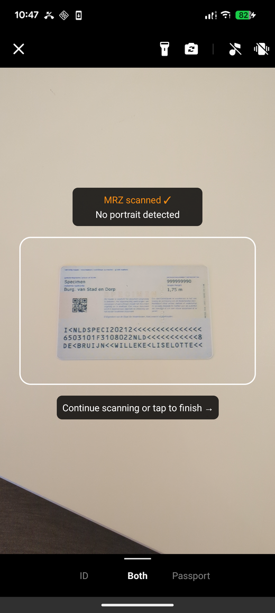

# MRZ Scanner User Guide (Android Edition)

The Dynamsoft MRZ Scanner (Android Edition) provides a ready-to-use scanning component that lets you add MRZ reading to your app with minimal setup. This guide walks through building an MRZ scanning app from scratch using `MRZScannerActivity` — the built-in activity that handles the camera UI, scanning logic, and result delivery.

> [!TIP]
> The app built here is **ScanMRZBasic**, available on GitHub in [Java](https://github.com/Dynamsoft/mrz-scanner-mobile/tree/main/android/samples/ScanMRZBasic) and [Kotlin](https://github.com/Dynamsoft/mrz-scanner-mobile/tree/main/android/samples/ScanMRZBasicKt). For a fuller app with a dedicated result screen, document images, and camera-permission recovery, see the [ScanMRZ Sample Walkthrough](../samples/scanmrz-walkthrough.md).

> [!IMPORTANT]
> Upgrading an existing integration rather than starting fresh? See the [Upgrade Guide](upgrade.md) first.

## Supported Document Types

The SDK supports three ICAO Machine Readable Travel Document (MRTD) formats: **TD1** (ID cards, 3-line MRZ), **TD2** (ID cards, 2-line MRZ), and **TD3** (passports, 2-line MRZ). For a visual reference of each format, see [Supported Document Types](../../shared/supported-document-types.md).

> [!NOTE]
> For support for other MRTD types, contact the [Dynamsoft Support Team](https://www.dynamsoft.com/contact/).

## System Requirements

- Supported OS: **Android 5.0** (API Level 21) or higher.
- Supported ABI: **armeabi-v7a**, **arm64-v8a**, **x86** and **x86_64**.
- Development Environment:
   - IDE: **Android Studio 2024.3.2** suggested.
   - JDK: **Java 17** or higher.
   - Gradle: **8.0** or higher.
- Hardware: **a physical Android device**. The Android Emulator does not expose a camera, so the scanner cannot run on it.

## Licensing

A valid license key is required to use the SDK. If you are just getting started, request a free 30-day trial license below:



> [!NOTE]
>
> - The license string above grants a time-limited free trial which requires a network connection.
> - You can request a 30-day trial license via the [Request a Trial License](https://www.dynamsoft.com/customer/license/trialLicense?product=mrz&utm_source=guide&package=android){:target="_blank"} link.
> - For production license setup, see the [License Activation](license-activation.md) guide.

## Add the SDK

1. Open **settings.gradle** (Groovy DSL) or **settings.gradle.kts** (Kotlin DSL) at the project root and add the Dynamsoft Maven repository to the `dependencyResolutionManagement` block:

   <div class="sample-code-prefix"></div>
   >- Groovy
   >- Kotlin
   >
   >1. 
   ```groovy
   dependencyResolutionManagement {
           repositoriesMode.set(RepositoriesMode.FAIL_ON_PROJECT_REPOS)
           repositories {
               google()
               mavenCentral()
               maven {
                   url "https://download2.dynamsoft.com/maven/aar"
               }
           }
   }
   ```
   2. 
   ```kotlin
   dependencyResolutionManagement {
           repositoriesMode.set(RepositoriesMode.FAIL_ON_PROJECT_REPOS)
           repositories {
               google()
               mavenCentral()
               maven {
                   url = uri("https://download2.dynamsoft.com/maven/aar")
               }
           }
   }
```

2. Open **build.gradle** (Module: app) for Groovy DSL — or **build.gradle.kts** (Module: app) for Kotlin DSL — and add the dependency:

   <div class="sample-code-prefix"></div>
   >- Groovy
   >- Kotlin
   >
   >1. 
   ```groovy
   dependencies {
           implementation 'com.dynamsoft:mrzscannerbundle:3.6.2000'
   }
   ```
   2. 
   ```kotlin
   dependencies {
           implementation("com.dynamsoft:mrzscannerbundle:3.6.2000")
   }
```

3. Click **Sync Now**. After the synchronization completes, the SDK is added to the project.

## Building the MRZ Scanner Application

The following steps build **ScanMRZBasic** — the smallest app that scans an MRZ and shows the parsed result. You can download the finished project from GitHub in [Java](https://github.com/Dynamsoft/mrz-scanner-mobile/tree/main/android/samples/ScanMRZBasic) or [Kotlin](https://github.com/Dynamsoft/mrz-scanner-mobile/tree/main/android/samples/ScanMRZBasicKt).

The whole app is a single activity: a button launches the scanner, and the result renders on the same screen. For a fuller app with a dedicated result screen, a document image pager, per-field validation explanations, and camera-permission recovery, see the [ScanMRZ Sample Walkthrough](../samples/scanmrz-walkthrough.md).

Before you start, have these ready:

- **A license key** — a trial key is embedded in the snippets below, but you can request your own from the [Licensing](#licensing) section.
- **A physical Android device**, connected over USB. Step 6 covers enabling USB debugging if you have not done so before.
- **A document to scan** — any passport or ID card carrying a TD1, TD2, or TD3 machine-readable zone. See [Supported Document Types](../../shared/supported-document-types.md) for what each format looks like.

> [!NOTE]
> The Kotlin snippets below use the package `com.dynamsoft.scanmrzbasic`, matching the project name from Step 1. The downloadable Kotlin sample uses `com.dynamsoft.scanmrzbasickt` so that both samples can be installed on one device. The code is otherwise identical.

### Step 1: Create a New Project

1. Open Android Studio and select **File > New > New Project**.
2. Choose **Empty Views Activity** as the project template.
3. Set the app name to *ScanMRZBasic*, choose a save location, and set the **Minimum SDK** to 21.
4. Choose your preferred **Language** (either **Java** or **Kotlin**) and **Build configuration language** (either **Kotlin DSL** or **Groovy DSL**). The SDK supports all combinations — the snippets below cover both languages, and the [Add the SDK](#add-the-sdk) section covers both DSLs.

### Step 2: Add the SDK

Follow the instructions in the [Add the SDK](#add-the-sdk) section above to add `mrzscannerbundle` to your project.

### Step 3: Add the App Resources

Three resource files support the screen you build in Step 4. Start with **colors.xml** in **src/main/res/values/**, which defines the text color and the amber used to flag a field that fails validation:

```xml
<?xml version="1.0" encoding="utf-8"?>
<resources>
    <color name="white">#FFFFFFFF</color>
    <!-- Applied to a field whose value does not match its check digit. -->
    <color name="warning_amber">#FFC107</color>
</resources>
```

Add the two strings the screen needs to **strings.xml** in the same folder. Your project already has an `app_name` entry, generated when you created it:

```xml
<string name="scan_an_mrz">Scan an MRZ</string>
<string name="scan_cancelled">Scan cancelled</string>
```

Finally, replace **themes.xml** in the same folder:

```xml
<resources>

    <style name="Theme.MRZScannerBasic" parent="Theme.AppCompat.NoActionBar">
        <item name="textAllCaps">false</item>
        <item name="colorAccent">@android:color/white</item>
        <item name="buttonTint">@color/white</item>
    </style>

    <!-- The two styles below just keep the field rows in activity_main.xml to one
         line each; they carry no SDK behavior. -->
    <style name="FieldLabel">
        <item name="android:layout_width">match_parent</item>
        <item name="android:layout_height">wrap_content</item>
        <item name="android:paddingTop">12dp</item>
        <item name="android:textSize">12sp</item>
    </style>

    <style name="FieldValue">
        <item name="android:layout_width">match_parent</item>
        <item name="android:layout_height">wrap_content</item>
        <item name="android:textStyle">bold</item>
    </style>

</resources>
```

The theme parents to `Theme.AppCompat` because this project does not use Material Components. `FieldLabel` and `FieldValue` are ordinary layout styles that keep each field row in the next step to a single line; neither carries any SDK behavior.

### Step 4: Set Up the Layout

Open **activity_main.xml** in **src/main/res/layout/** and replace its contents. The screen has two halves: a **Scan an MRZ** button, and a result area that stays hidden until a scan succeeds.

```xml
<?xml version="1.0" encoding="utf-8"?>
<!--
    Deliberately plain — the smallest layout that can show a scan result. See the
    ScanMRZ sample for a styled result screen.

    The scan button sits outside the ScrollView so it stays reachable at the bottom of
    the screen while a long result scrolls above it.
-->
<LinearLayout xmlns:android="http://schemas.android.com/apk/res/android"
    xmlns:tools="http://schemas.android.com/tools"
    android:id="@+id/main"
    android:layout_width="match_parent"
    android:layout_height="match_parent"
    android:orientation="vertical"
    tools:context=".MainActivity">

    <ScrollView
        android:layout_width="match_parent"
        android:layout_height="0dp"
        android:layout_weight="1">

        <LinearLayout
            android:layout_width="match_parent"
            android:layout_height="wrap_content"
            android:orientation="vertical"
            android:padding="16dp">

            <!-- Carries the cancelled message and any error string. -->
            <TextView
                android:id="@+id/tv_status"
                style="@style/FieldValue"
                android:textSize="16sp"
                android:visibility="gone"
                tools:text="Scan cancelled"
                tools:visibility="visible" />

            <LinearLayout
                android:id="@+id/result_panel"
                android:layout_width="match_parent"
                android:layout_height="wrap_content"
                android:orientation="vertical"
                android:visibility="gone"
                tools:visibility="visible">

                <ImageView
                    android:id="@+id/iv_portrait"
                    android:layout_width="96dp"
                    android:layout_height="128dp"
                    android:scaleType="fitCenter"
                    android:visibility="gone"
                    tools:visibility="visible" />

                <TextView style="@style/FieldLabel" android:text="Full Name" />
                <TextView android:id="@+id/tv_full_name" style="@style/FieldValue" />

                <TextView style="@style/FieldLabel" android:text="Document Number" />
                <TextView android:id="@+id/tv_doc_number" style="@style/FieldValue" />

                <TextView style="@style/FieldLabel" android:text="Nationality" />
                <TextView android:id="@+id/tv_nationality" style="@style/FieldValue" />

                <TextView style="@style/FieldLabel" android:text="Date of Birth" />
                <TextView android:id="@+id/tv_date_of_birth" style="@style/FieldValue" />

                <TextView style="@style/FieldLabel" android:text="Date of Expiry" />
                <TextView android:id="@+id/tv_date_of_expiry" style="@style/FieldValue" />

                <TextView style="@style/FieldLabel" android:text="Document Type" />
                <TextView android:id="@+id/tv_doc_type" style="@style/FieldValue" />

                <TextView style="@style/FieldLabel" android:text="Raw MRZ Text" />
                <TextView
                    android:id="@+id/tv_raw_mrz"
                    style="@style/FieldValue"
                    android:fontFamily="monospace" />
            </LinearLayout>
        </LinearLayout>
    </ScrollView>

    <androidx.appcompat.widget.AppCompatButton
        android:id="@+id/btn_scan"
        android:layout_width="match_parent"
        android:layout_height="wrap_content"
        android:layout_margin="16dp"
        android:padding="16dp"
        android:text="@string/scan_an_mrz"
        android:textSize="18sp" />

</LinearLayout>
```

`MainActivity` looks up six things in this layout, so the IDs matter:

| ID | Purpose |
| -- | ------- |
| `main` | The root view. Window insets are applied to it so content clears the status and navigation bars. |
| `btn_scan` | Launches the scanner. |
| `tv_status` | Carries the "Scan cancelled" message and any error string. Hidden until one of them applies. |
| `result_panel` | Wraps the whole result area. Starts `gone`, becomes visible only after a successful scan. |
| `iv_portrait` | The portrait cropped from the document, when one was found. |
| `tv_full_name` … `tv_raw_mrz` | One `TextView` per parsed field. |

Keeping `result_panel` hidden until there is something to show means the screen never displays a set of empty labels.

### Step 5: Launch the Scanner and Show the Result

Open **MainActivity** and replace its contents. This is the whole application: it provides a license, launches `MRZScannerActivity`, and renders whichever of the three result statuses comes back.

For optional config settings like document type filtering, UI visibility, and image capture, see the [Customize MRZ Scanner](customize-mrz-scanner.md) guide.

You do not need to write any camera-permission code. The `CAMERA` permission is declared by the SDK and merged into your app at build time, and `MRZScannerActivity` requests it on first launch. If access is unavailable the scanner shows a dialog offering **Allow camera access** or **Open Settings**, never starts the camera, and reports the outcome as `RS_EXCEPTION`.

> [!NOTE]
> To present your own permission UI instead, call `config.setCameraPermissionPromptEnabled(false)`. The scanner then suppresses its dialog but still reports the denial, and still never starts the camera without access. See [Customize MRZ Scanner](customize-mrz-scanner.md#handling-camera-permission) for the full flow.

<div class="sample-code-prefix"></div>
>- Java
>- Kotlin
>
>1. 
```java
package com.dynamsoft.scanmrzbasic;
import android.os.Bundle;
import android.view.View;
import android.widget.ImageView;
import android.widget.TextView;
import androidx.activity.EdgeToEdge;
import androidx.activity.result.ActivityResultLauncher;
import androidx.appcompat.app.AppCompatActivity;
import androidx.core.content.ContextCompat;
import androidx.core.graphics.Insets;
import androidx.core.view.ViewCompat;
import androidx.core.view.WindowInsetsCompat;
import com.dynamsoft.core.basic_structures.CoreException;
import com.dynamsoft.core.basic_structures.ImageData;
import com.dynamsoft.dcp.EnumValidationStatus;
import com.dynamsoft.mrzscannerbundle.ui.MRZData;
import com.dynamsoft.mrzscannerbundle.ui.MRZScanResult;
import com.dynamsoft.mrzscannerbundle.ui.MRZScannerActivity;
import com.dynamsoft.mrzscannerbundle.ui.MRZScannerConfig;
// Launches the built-in MRZ scanner and renders the result on this same screen.
// The whole sample is this one activity. See the ScanMRZ sample for a fuller
// app: document images, per-field explanations and permission recovery.
public class MainActivity extends AppCompatActivity {
    private final MRZScannerConfig config = new MRZScannerConfig();
    private ActivityResultLauncher<MRZScannerConfig> launcher;
    @Override
    protected void onCreate(Bundle savedInstanceState) {
        super.onCreate(savedInstanceState);
        EdgeToEdge.enable(this);
        setContentView(R.layout.activity_main);
        ViewCompat.setOnApplyWindowInsetsListener(findViewById(R.id.main), (v, insets) -> {
            Insets bars = insets.getInsets(WindowInsetsCompat.Type.systemBars());
            v.setPadding(bars.left, bars.top, bars.right, bars.bottom);
            return insets;
        });
        // A trial license, so it needs a network connection. Request your own at
        // https://www.dynamsoft.com/customer/license/trialLicense?product=mrz&utm_source=samples&package=android
        config.setLicense("DLS2eyJvcmdhbml6YXRpb25JRCI6IjIwMDAwMSJ9");
        // The scanner runs as its own activity, so its result arrives through the
        // Activity Result API rather than a callback on this class.
        launcher = registerForActivityResult(
                new MRZScannerActivity.ResultContract(), this::showResult);
        findViewById(R.id.btn_scan).setOnClickListener(v -> launcher.launch(config));
    }
    // Renders one of the three result statuses the scanner can come back with.
    private void showResult(MRZScanResult result) {
        TextView tvStatus = findViewById(R.id.tv_status);
        View resultPanel = findViewById(R.id.result_panel);
        if (result.getResultStatus() == MRZScanResult.EnumResultStatus.RS_CANCELED) {
            // The user closed the scanner. There is no data and nothing went wrong.
            tvStatus.setText(R.string.scan_cancelled);
            tvStatus.setVisibility(View.VISIBLE);
            resultPanel.setVisibility(View.GONE);
            return;
        }
        if (result.getResultStatus() == MRZScanResult.EnumResultStatus.RS_EXCEPTION) {
            // The scanner asks for camera access itself, so a denial lands here as a
            // readable error string — this sample needs no permission code of its own.
            tvStatus.setText(result.getErrorString());
            tvStatus.setVisibility(View.VISIBLE);
            resultPanel.setVisibility(View.GONE);
            return;
        }
        tvStatus.setVisibility(View.GONE);
        resultPanel.setVisibility(View.VISIBLE);
        MRZData data = result.getData();
        // Validation is per field, so a full name that joins two of them is flagged
        // when either half fails.
        int firstNameStatus = data.getFieldValidationStatus("firstName");
        int nameStatus = firstNameStatus == EnumValidationStatus.VS_FAILED
                ? firstNameStatus
                : data.getFieldValidationStatus("lastName");
        String fullName = (data.getFirstName() + " " + data.getLastName()).trim();
        applyField(findViewById(R.id.tv_full_name), fullName, nameStatus);
        applyField(findViewById(R.id.tv_doc_number), data.getDocumentNumber(),
                data.getFieldValidationStatus("documentNumber"));
        applyField(findViewById(R.id.tv_nationality), data.getNationality(),
                data.getFieldValidationStatus("nationality"));
        applyField(findViewById(R.id.tv_date_of_birth), data.getDateOfBirth(),
                data.getFieldValidationStatus("dateOfBirth"));
        applyField(findViewById(R.id.tv_date_of_expiry), data.getDateOfExpire(),
                data.getFieldValidationStatus("dateOfExpire"));
        // The document type comes from the MRZ layout itself, so it has no check digit.
        applyField(findViewById(R.id.tv_doc_type), data.getDocumentType(),
                EnumValidationStatus.VS_NONE);
        applyField(findViewById(R.id.tv_raw_mrz), data.getMrzText(),
                data.getFieldValidationStatus("mrzText"));
        showPortrait(result.getPortraitImage());
    }
    // The portrait is returned by default, but is null when none could be cropped.
    private void showPortrait(ImageData portrait) {
        ImageView ivPortrait = findViewById(R.id.iv_portrait);
        ivPortrait.setVisibility(View.GONE);
        if (portrait == null) {
            return;
        }
        try {
            ivPortrait.setImageBitmap(portrait.toBitmap());
            ivPortrait.setVisibility(View.VISIBLE);
        } catch (CoreException ignored) {
        }
    }
    // Shows value, or "N/A" when the parser extracted nothing, and colors the
    // row amber when the value does not match its check digit.
    private void applyField(TextView tv, String value, int status) {
        boolean failed = status == EnumValidationStatus.VS_FAILED;
        tv.setText(value == null || value.isEmpty() ? "N/A" : value);
        tv.setTextColor(ContextCompat.getColor(this,
                failed ? R.color.warning_amber : R.color.white));
    }
}
```
2. 
```kotlin
package com.dynamsoft.scanmrzbasic
import android.os.Bundle
import android.view.View
import android.widget.ImageView
import android.widget.TextView
import androidx.activity.enableEdgeToEdge
import androidx.activity.result.ActivityResultLauncher
import androidx.appcompat.app.AppCompatActivity
import androidx.core.content.ContextCompat
import androidx.core.view.ViewCompat
import androidx.core.view.WindowInsetsCompat
import com.dynamsoft.core.basic_structures.CoreException
import com.dynamsoft.core.basic_structures.ImageData
import com.dynamsoft.dcp.EnumValidationStatus
import com.dynamsoft.mrzscannerbundle.ui.MRZScanResult
import com.dynamsoft.mrzscannerbundle.ui.MRZScannerActivity
import com.dynamsoft.mrzscannerbundle.ui.MRZScannerConfig
// Launches the built-in MRZ scanner and renders the result on this same screen.
// The whole sample is this one activity. See the ScanMRZ sample for a fuller app:
// document images, per-field explanations and permission recovery.
class MainActivity : AppCompatActivity() {
    private val config = MRZScannerConfig()
    private lateinit var launcher: ActivityResultLauncher<MRZScannerConfig>
    override fun onCreate(savedInstanceState: Bundle?) {
        super.onCreate(savedInstanceState)
        enableEdgeToEdge()
        setContentView(R.layout.activity_main)
        ViewCompat.setOnApplyWindowInsetsListener(findViewById(R.id.main)) { v, insets ->
            val bars = insets.getInsets(WindowInsetsCompat.Type.systemBars())
            v.setPadding(bars.left, bars.top, bars.right, bars.bottom)
            insets
        }
        // A trial license, so it needs a network connection. Request your own at
        // https://www.dynamsoft.com/customer/license/trialLicense?product=mrz&utm_source=samples&package=android
        config.license = "DLS2eyJvcmdhbml6YXRpb25JRCI6IjIwMDAwMSJ9"
        // The scanner runs as its own activity, so its result arrives through the
        // Activity Result API rather than a callback on this class.
        launcher = registerForActivityResult(MRZScannerActivity.ResultContract()) { result ->
            showResult(result)
        }
        findViewById<View>(R.id.btn_scan).setOnClickListener { launcher.launch(config) }
    }
    // Renders one of the three result statuses the scanner can come back with.
    private fun showResult(result: MRZScanResult) {
        val tvStatus = findViewById<TextView>(R.id.tv_status)
        val resultPanel = findViewById<View>(R.id.result_panel)
        if (result.resultStatus == MRZScanResult.EnumResultStatus.RS_CANCELED) {
            // The user closed the scanner. There is no data and nothing went wrong.
            tvStatus.setText(R.string.scan_cancelled)
            tvStatus.visibility = View.VISIBLE
            resultPanel.visibility = View.GONE
            return
        }
        if (result.resultStatus == MRZScanResult.EnumResultStatus.RS_EXCEPTION) {
            // The scanner asks for camera access itself, so a denial lands here as a
            // readable error string — this sample needs no permission code of its own.
            tvStatus.text = result.errorString
            tvStatus.visibility = View.VISIBLE
            resultPanel.visibility = View.GONE
            return
        }
        tvStatus.visibility = View.GONE
        resultPanel.visibility = View.VISIBLE
        val data = result.data
        // Validation is per field, so a full name that joins two of them is flagged
        // when either half fails.
        val firstNameStatus = data.getFieldValidationStatus("firstName")
        val nameStatus = if (firstNameStatus == EnumValidationStatus.VS_FAILED) {
            firstNameStatus
        } else {
            data.getFieldValidationStatus("lastName")
        }
        val fullName = (data.firstName + " " + data.lastName).trim()
        applyField(findViewById(R.id.tv_full_name), fullName, nameStatus)
        applyField(findViewById(R.id.tv_doc_number), data.documentNumber,
            data.getFieldValidationStatus("documentNumber"))
        applyField(findViewById(R.id.tv_nationality), data.nationality,
            data.getFieldValidationStatus("nationality"))
        applyField(findViewById(R.id.tv_date_of_birth), data.dateOfBirth,
            data.getFieldValidationStatus("dateOfBirth"))
        applyField(findViewById(R.id.tv_date_of_expiry), data.dateOfExpire,
            data.getFieldValidationStatus("dateOfExpire"))
        // The document type comes from the MRZ layout itself, so it has no check digit.
        applyField(findViewById(R.id.tv_doc_type), data.documentType,
            EnumValidationStatus.VS_NONE)
        applyField(findViewById(R.id.tv_raw_mrz), data.mrzText,
            data.getFieldValidationStatus("mrzText"))
        showPortrait(result.portraitImage)
    }
    // The portrait is returned by default, but is null when none could be cropped.
    private fun showPortrait(portrait: ImageData?) {
        val ivPortrait = findViewById<ImageView>(R.id.iv_portrait)
        ivPortrait.visibility = View.GONE
        if (portrait == null) {
            return
        }
        try {
            ivPortrait.setImageBitmap(portrait.toBitmap())
            ivPortrait.visibility = View.VISIBLE
        } catch (ignored: CoreException) {
        }
    }
    // Shows value, or "N/A" when the parser extracted nothing, and colors the row
    // amber when the value does not match its check digit.
    private fun applyField(tv: TextView, value: String?, status: Int) {
        val failed = status == EnumValidationStatus.VS_FAILED
        tv.text = if (value.isNullOrEmpty()) "N/A" else value
        tv.setTextColor(
            ContextCompat.getColor(this, if (failed) R.color.warning_amber else R.color.white)
        )
    }
}
```

**Key APIs in use**

- **`MRZScannerConfig`** — carries your license and any optional settings. The same instance is handed to every launch, so configure it once.
- **`MRZScannerActivity.ResultContract`** — the Activity Result contract for the scanner. `registerForActivityResult` returns a launcher that accepts an `MRZScannerConfig` and delivers an `MRZScanResult` back. The scanner runs as its own activity, which is why the result arrives here rather than through a listener you register on the config.
- **`getResultStatus()`** — one of `RS_FINISHED`, `RS_CANCELED`, or `RS_EXCEPTION`. Handle all three: cancellation and failure are reported through the same path as success rather than thrown, so a scanner that never produces a result is usually an unhandled status rather than a crash.
- **`getErrorString()`** — a readable message that accompanies `RS_EXCEPTION`. [`getErrorCode`](../api-reference/mrz-scan-result.md#geterrorcode) gives the machine-readable code behind it.
- **`getData()`** — the parsed [`MRZData`](../api-reference/mrz-data.md), holding every field read from the document.
- **`getPortraitImage()`** — the portrait cropped from the document, or `null` when none was found. `toBitmap()` throws `CoreException`, so it is wrapped in a `try`.

**Reading a field's validation status**

Most MRZ fields are protected by a check digit, and [`getFieldValidationStatus`](../api-reference/mrz-data.md#getfieldvalidationstatus) reports whether the value read from the document matched it. It takes the same field names as the getters on `MRZData`:

```java
applyField(findViewById(R.id.tv_doc_number), data.getDocumentNumber(),
        data.getFieldValidationStatus("documentNumber"));
```

The result is `VS_SUCCEEDED`, `VS_NONE` when the field carries no check digit, or `VS_FAILED` when the value and its check digit disagree — meaning the document may be misread, invalid, or altered. `applyField` colors the row amber in that case. Note that the value is still returned either way, so you can decide whether to accept it, prompt for a re-scan, or ask for manual correction.

The full name is the one field that needs two lookups, because the single line on screen joins two separately validated fields:

```java
int firstNameStatus = data.getFieldValidationStatus("firstName");
int nameStatus = firstNameStatus == EnumValidationStatus.VS_FAILED
        ? firstNameStatus
        : data.getFieldValidationStatus("lastName");
```

Either half failing should flag the whole line, so a failed `firstName` wins; otherwise the status of `lastName` is used. Document type is passed `VS_NONE` explicitly, since it is derived from the MRZ layout itself rather than read from a field with a check digit.

> [!TIP]
> The [ScanMRZ Sample Walkthrough](../samples/scanmrz-walkthrough.md) shows a richer treatment of the same API: an error icon, an underline marking the row as tappable, and a dialog explaining what a failed check digit means.

### Step 6: Run the Project

Before running, complete these steps on your Android device:

1. **Enable USB Debugging** — Go to **Settings > About Phone** and tap **Build Number** seven times to unlock Developer Options. Then go to **Settings > Developer Options** and enable **USB Debugging**.

2. **Connect your device** — Connect your Android device to your development machine via USB. If prompted on the device, tap **Allow** to authorize the debugging connection.

3. **Select your device** — In Android Studio, select your connected device from the run configuration dropdown at the top of the IDE.

4. **Click Run.**

Tap **Scan an MRZ**, point the camera at the machine-readable zone of a passport or ID card, and the parsed fields appear on the screen behind the scanner.

> [!NOTE]
> A physical Android device is required. The camera is not available on the Android Emulator.

## Results and Image Lifetime

The scanner is a separate activity, which shapes how results reach you and how long the images in them stay valid.

### How the result arrives

`MRZScannerActivity.ResultContract` is an `ActivityResultContract`, so the scanner is launched and its result collected through the standard Activity Result API rather than a listener you register on the config. Two things follow from that:

- **Register the launcher unconditionally**, at the point where the activity is constructed — in `onCreate`, not inside a click handler. Android restores pending results during activity recreation, and a launcher registered later may miss one.
- **One launcher handles any number of scans.** Call `launch(config)` again for a re-scan; there is no teardown between runs, and the same `MRZScannerConfig` can be reused.

The config is read when the scanner starts, so changes made to it between launches take effect on the next scan.

### How long the images stay valid

`getDocumentImage`, `getOriginalImage`, and `getPortraitImage` return `ImageData` backed by a native buffer rather than an ordinary `Bitmap`. Each `MRZScanResult` holds a reference to those buffers and releases it when the object is collected.

You do not have to manage this. Passing a result to another activity through an `Intent` works without any extra call: the instance that comes out the other side takes its own reference as it is unparceled, so the buffers stay alive as long as any result object still points at them.

> [!IMPORTANT]
> Do not call `retainAllImageInstances()` or `releaseAllImageInstances()`. Both are annotated `@RestrictTo(LIBRARY_GROUP)` and exist for the SDK's internal use. Taking a manual reference leaks the buffer, because nothing will ever release it.

If you need an image to outlive the result — to cache it, upload it, or hold it in a view model — convert it to something with ordinary Java lifetime as soon as you receive it:

<div class="sample-code-prefix"></div>
>- Java
>- Kotlin
>
>1. 
```java
ImageData portrait = result.getPortraitImage();
if (portrait != null) {
       try {
          Bitmap bitmap = portrait.toBitmap(); // an ordinary Bitmap, safe to keep
       } catch (CoreException e) {
          e.printStackTrace();
       }
}
```
2. 
```kotlin
val portrait = result.portraitImage
if (portrait != null) {
       try {
          val bitmap = portrait.toBitmap() // an ordinary Bitmap, safe to keep
       } catch (e: CoreException) {
          e.printStackTrace()
       }
}
```

`toBitmap()` produces an ordinary `Bitmap`, subject to normal garbage collection and no longer tied to the result.

## The Scanner Screen

`MRZScannerActivity` supplies its own full-screen UI, so nothing above defines what the user sees while scanning. Knowing what it presents is worth a moment, because it determines how much guidance your own screens need to provide.

The screen is a live camera preview with a **guide frame** marking where to place the document, a **toolbar** across the top carrying the close, torch, camera-toggle, beep, and vibrate buttons, a **format selector** along the bottom for choosing between ID, passport, or both, and a **prompt** that updates as the scan progresses. Every one of these can be hidden — see [Configure the UI Elements](customize-mrz-scanner.md#configure-the-ui-elements).

### What the user is told

The scanner narrates its own progress, so the prompt text is the main thing a user follows:

| Stage | On screen |
| ----- | --------- |
| Waiting for a document | **Scan the MRZ side first** |
| Text lines detected in frame | A spinner beside the guide frame |
| MRZ read, nothing further needed | **MRZ scanned ✓** |
| MRZ read, portrait found on the same side | **MRZ scanned ✓ / Portrait scanned ✓** |
| MRZ read, opposite side needed | **MRZ scanned ✓ / Flip and scan the other side**, with an animated flip prompt |
| Both sides captured | **MRZ scanned ✓ / Both sides scanned ✓** |

The spinner is not a generic busy indicator. It is driven by per-frame text-line detection, so it appears when the scanner can see MRZ-like text and is working on it, and disappears when the document moves out of frame. Once the MRZ is confirmed it stops for the rest of the session. Treated as a signal, it tells the user that holding steady is worthwhile.

> [!NOTE]
> The prompt is hidden along with the guide frame, since it reads as a label on it. Hiding the frame also widens the scanned area to the whole preview — see [Hiding the guide frame](customize-mrz-scanner.md#hiding-the-guide-frame).

The last three rows are covered in detail in the next section.

## Scanning Two-Sided Documents

On a passport the machine-readable zone and the portrait share one page, so a single capture collects everything. On most TD1 and TD2 ID cards they are on opposite sides, and the scanner has to see both. It handles this itself — the app you built above needs no extra code — but it changes what the scan looks like to the user and what comes back in the result.

The scanner always reads the **MRZ side first**, whichever physical side that is. The API names the sides `DS_MRZ` and `DS_OPPOSITE` for that reason: document layouts vary by country, so there is no guarantee the MRZ is on the back or that the portrait is on the front.

### What happens during a scan

1. The user scans the MRZ side. This fills the images returned for `DS_MRZ`.
2. The scanner looks for a portrait on that same side. If it finds one — the usual case for a passport — the scan ends there and **`DS_OPPOSITE` stays `null`**.
3. If no portrait is found and the document is not a passport, the scanner shows **"Flip and scan the other side"** with an animated prompt. Once the opposite side is captured, its images fill `DS_OPPOSITE` and the portrait is taken from it.

A passport that yields no portrait is treated differently: the scanner keeps looking on the same page rather than asking for a flip, since flipping a passport would not help.

> [!NOTE]
> Five seconds after the MRZ is read, a tappable **"Continue scanning or tap to finish →"** prompt appears. It lets the user finish with whatever has been captured so far, which is the way out when a document has no portrait to find. Ending the scan this way leaves `DS_OPPOSITE` and the portrait `null`, so treat both as optional in your result handling.

<div align="center">
    <p></p>
    <p>The scanner offering a way out when no portrait is found</p>
</div>

### What you get back

Assuming default settings:

| Document | `getDocumentImage(DS_MRZ)` | `getDocumentImage(DS_OPPOSITE)` | `getPortraitImage()` |
| -------- | ------------------------- | ------------------------------- | -------------------- |
| Passport (TD3) | populated | `null` | populated, from the MRZ side |
| ID card (TD1 / TD2) | populated | populated | populated, from the opposite side |
| Any document, with `setReturnPortraitImage(false)` | populated | `null` | `null` |

The same pattern applies to `getOriginalImage(side)` once `setReturnOriginalImage(true)` is set.

### Turning it off

Two-sided scanning is driven entirely by the portrait. It is on by default because `setReturnPortraitImage` defaults to `true`; setting it to `false` ends every scan as soon as the MRZ is read:

<div class="sample-code-prefix"></div>
>- Java
>- Kotlin
>
>1. 
```java
config.setReturnPortraitImage(false);
```
2. 
```kotlin
config.isReturnPortraitImage = false
```

That is the right choice when you only need the parsed text, and it makes every scan a single capture. `getPortraitImage()` and both `DS_OPPOSITE` getters then always return `null`.

For an example that displays the document images from both sides, see the [ScanMRZ Sample Walkthrough](../samples/scanmrz-walkthrough.md).

## Preparing for Release

Two things are worth checking before you ship a build that includes the scanner: that shrinking has not broken the native bindings, and that you are not shipping more of the SDK than your users need.

### Shrinking and obfuscation

The SDK needs no keep rules of its own, so a project using Android's default configuration builds correctly with `minifyEnabled true` and nothing added.

That default matters, though. Several SDK classes declare `native` methods that the native layer resolves **by name**, so renaming or removing them breaks the binding at runtime rather than at build time. The rule that protects them ships in `proguard-android-optimize.txt`, which new projects reference by default:

```
-keepclasseswithmembernames class * {
    native <methods>;
}
```

If your project uses a hand-written configuration instead of the default file, carry that rule across.

### App size

Most of the footprint is the Dynamsoft Capture Vision engine and its models, not the MRZ layer. Measured from a build of `ScanMRZBasic`, the native libraries alone come to:

| ABI | Native libraries |
| --- | ---------------- |
| `armeabi-v7a` | ~11 MB |
| `arm64-v8a` | ~16 MB |
| `x86` | ~19 MB |
| `x86_64` | ~19 MB |

A single APK carrying all four is the worst case. Two ways to avoid it:

- **Publish an Android App Bundle.** Google Play generates per-device APKs from it and delivers only the matching ABI, so a user installs roughly one column of that table rather than all of it. This is the recommended option and needs no configuration.
- **Filter ABIs** when you distribute APKs directly. `x86` and `x86_64` mostly serve emulators, and the scanner needs a camera the emulator does not provide — but ChromeOS devices are `x86_64` and do have cameras, so drop them only if you know your distribution does not include them:

<div class="sample-code-prefix"></div>
>- Groovy
>- Kotlin
>
>1. 
```groovy
android {
       defaultConfig {
          ndk {
             abiFilters 'armeabi-v7a', 'arm64-v8a'
          }
       }
}
```
2. 
```kotlin
android {
       defaultConfig {
          ndk {
             abiFilters += listOf("armeabi-v7a", "arm64-v8a")
          }
       }
}
```

### 16 KB page sizes

The SDK's native libraries are built for devices whose kernels use a 16 KB memory page size, so no action is needed on your side.

## Next Steps

- **Go further** — Work through the [ScanMRZ Sample Walkthrough](../samples/scanmrz-walkthrough.md) to add a dedicated result screen, a document image pager, per-field validation explanations, and camera-permission recovery.
- **Samples** — Browse all four Android samples on the [Demo and Samples](../samples/index.md) page.
- **Customize** — Learn how to configure document type, UI elements, and feedback in the [Customize MRZ Scanner](customize-mrz-scanner.md) guide.
- **API Reference** — Browse the full [Android API Reference](../api-reference/index.md) for all classes and methods.
- **License** — See the [License Activation](license-activation.md) guide for production license setup.
- **Support** — Contact the [Dynamsoft Support Team](https://www.dynamsoft.com/contact/) for help or custom requirements.
