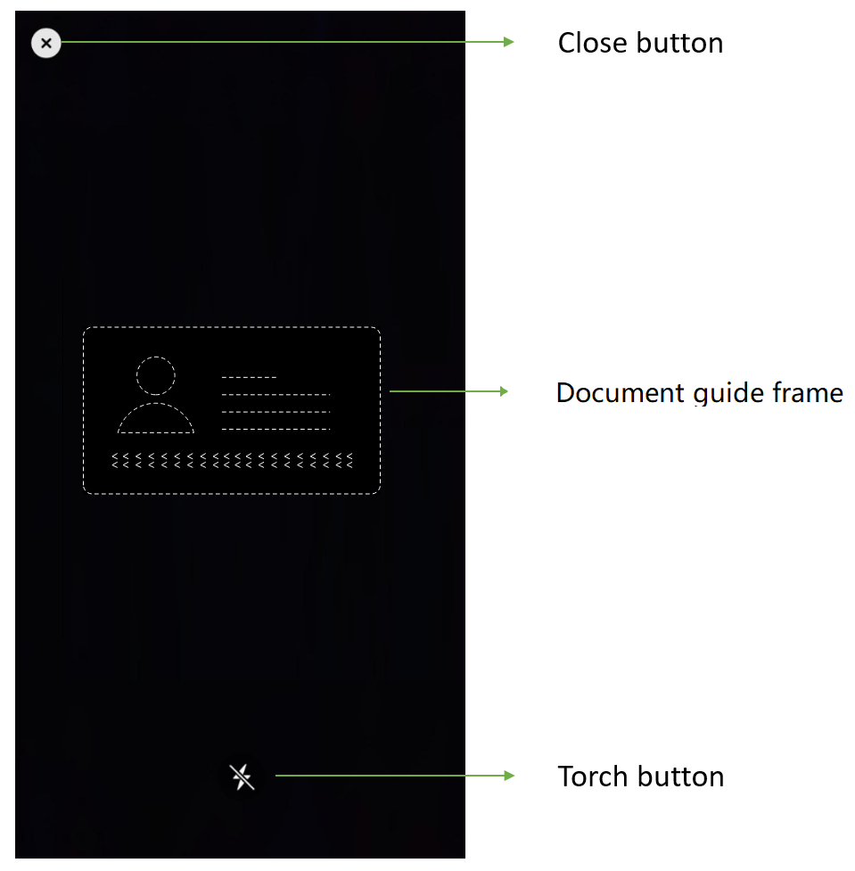

# Configure MRZ Scanner

When developing with `MRZScannerViewController`, you can add configurations via the `MRZScannerConfig` class. This page will guide you on how to configure the settings.

## Scan Document Type

### Set the document type via APIs

Specifies the type of document to scan, such as ID cards or passports. It also improves the processing speed and the accuracy.

<div class="sample-code-prefix"></div>
>- Objective-C
>- Swift
>
>1. 
```objc
DSMRZScannerConfig *config = [[DSMRZScannerConfig alloc] init];
config.documentType = DSDocumentTypePassport;
```
2. 
```swift
let config = MRZScannerConfig()
config.documentType = [.passport]
```

### Setup a customized template file

A template file is a JSON file that includes a series of algorithm parameter settings. It is always used to customize the performance for different usage scenarios. [Contact us](https://www.dynamsoft.com/company/customer-service/#contact) to get a customized template for your scanner.

1. Create a `DynamsoftResources` folder in the finder. Under the `DynamsoftResources` folder create a new folder, `Templates`.

2. Put your customized template json file under the `Templates` folder.

3. Rename the `DynamsoftResources` folder's extension name to .bundle and drag the `DynamsoftResources.bundle` into your project on Xcode. Select Create groups for the Added folders option.

4. Specify the template file via `templateFile` property

   <div class="sample-code-prefix"></div>
   >- Objective-C
   >- Swift
   >
   >1. 
   ```objc
   DSMRZScannerConfig *config = [[DSMRZScannerConfig alloc] init];
   config.templateFile = @"CustomizedTemplate.json";
   ```
   1. 
   ```swift
   let config = MRZScannerConfig()
   config.templateFile = "CustomizedTemplate.json"
   ```

> Note: You can also use a JSON string as the template file.

**Related APIs**

- [`documentType`]({{ site.ios_api }}mrz-scanner-config.html#documenttype)
- [`templateFile`]({{ site.ios_api }}mrz-scanner-config.html#templatefile)

## Configure the UI Elements

<div align="center">
    <p></p>
    <p>MRZ Scanner UI Components</p>
</div>

- Close button: Stop MRZ scanning and go back to the previous activity.
- Torch button: A clickable button that can turn on/off the torch.

<div class="sample-code-prefix"></div>
>- Objective-C
>- Swift
>
>1. 
```objc
DSMRZScannerConfig *config = [[DSMRZScannerConfig alloc] init];
config.isCloseButtonVisible = false;
config.isGuideFrameVisible = false;
config.isTorchButtonVisible = false;
```
2. 
```swift
let config = MRZScannerConfig()
config.isCloseButtonVisible = false
config.isGuideFrameVisible = false
config.isTorchButtonVisible = false
```

**Related APIs**

- [`torchButtonVisible`]({{ site.ios_api }}mrz-scanner-config.html#torchbuttonvisible)
- [`closeButtonVisible`]({{ site.ios_api }}mrz-scanner-config.html#closebuttonvisible)

### Beep

Let the app to trigger a beep sound when a MRZ is scanned successfully.

<div class="sample-code-prefix"></div>
>- Objective-C
>- Swift
>
>1. 
```objc
DSMRZScannerConfig *config = [[DSMRZScannerConfig alloc] init];
config.isBeepEnabled = true;
```
2. 
```swift
let config = MRZScannerConfig()
config.isBeepEnabled = true
```

**Related API**

- [`beepEnabled`]({{ site.ios_api }}mrz-scanner-config.html#beepenabled)

## Further Customization

If you have other customization requirements on the `MRZScanner` component, you can modify it with the [open source code on GitHub](https://github.com/Dynamsoft/mrz-scanner-mobile/).
