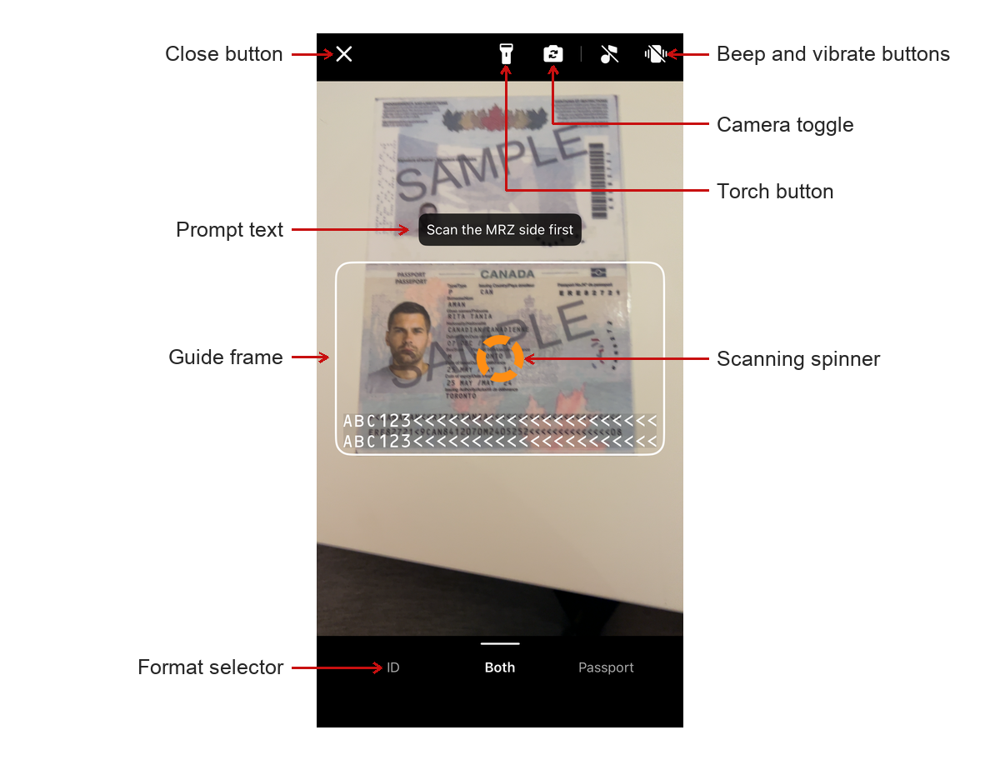

# Customizing the MRZ Scanner

`MRZScannerViewController` works out of the box with only a license key. This page covers what you can change through `MRZScannerConfig` when the defaults do not suit your app.

## MRZScannerConfig Overview

[**`MRZScannerConfig`**](../api-reference/mrz-scanner-config.md) carries almost every option the MRZ Scanner exposes. You build one, set the properties you need, and assign it to the `config` property of `MRZScannerViewController` before presenting it. The scanner reads it when it starts, so changing a property between presentations takes effect on the next scan.

`MRZScannerConfig` contains the following properties:

1. **`license`** - the license key is the **only property you must set**; every other property has a working default. If the license is undefined, invalid, or expired, the scanner cannot proceed and instead displays an error message telling the user to contact the app administrator.

2. **`documentType`** - specifies the type of document that the MRZ Scanner will recognize. This property accepts values defined in `DocumentType` such as `.all`, `.id`, or `.passport`. It helps the scanner to optimize its processing based on the expected document type. To learn more about the different document types that are supported, please refer to the [Supported Document Types](../../shared/supported-document-types.md) page.

3. **`templateFile`** - a template file is a JSON file or JSON string that contains a series of algorithm parameter settings (called Capture Vision templates) that is usually used for very specific and customized scanning and parsing scenarios. The `templateFile` points to the location of the JSON file. The MRZ Scanner comes with a default template file, but you may choose to use a custom template to target specialized use cases. We recommend contacting the [Dynamsoft Technical Support Team](https://www.dynamsoft.com/company/contact/) for assistance with template customization.

4. **`isBeepEnabled`** (default value `false`) - a boolean that determines whether a beep sound is triggered upon a successful MRZ scan. When enabled, the scanner will play a sound to provide audible feedback.

5. **`isVibrateEnabled`** (default value `false`) - controls whether the device vibrates upon a successful MRZ scan. When enabled, the scanner will vibrate to provide haptic feedback if the device supports it.

6. **`isCloseButtonVisible`** (default value `true`) - controls the visibility of the close button. When visible, users can tap this button to exit the scanning interface.

7. **`isTorchButtonVisible`** (default value `true`) - determines whether the torch (flashlight) toggle button is visible. When visible, users can switch the device flashlight on or off during scanning.

8. **`isCameraToggleButtonVisible`** (default value `true`) - specifies whether the camera toggle button is displayed. When visible, users can switch between the front and rear cameras.

9. **`isBeepButtonVisible`** (default value `true`) - controls whether the beep toggle button is visible in the scanning UI. When visible, users can tap this button to enable or disable the beep sound directly from the scanner interface.

10. **`isVibrateButtonVisible`** (default value `true`) - controls whether the vibrate toggle button is visible in the scanning UI. When visible, users can tap this button to enable or disable vibration feedback directly from the scanner interface.

11. **`isFormatSelectorVisible`** (default value `true`) - controls whether the document format selector is displayed at the bottom of the scanning UI. The format selector allows users to switch between scanning ID cards, passports, or both.

12. **`isGuideFrameVisible`** (default value `true`) - serves as a toggle to show or hide the guide frame overlay during scanning. The guide frame assists users in properly aligning the document for optimal MRZ detection. Hiding it also widens the scanned area to the whole camera preview and hides the prompt text — see [Hiding the guide frame](#hiding-the-guide-frame).

13. **`returnDocumentImage`** (default value `true`) - controls whether a cropped document image is included in the scan result. When enabled, the result's `getDocumentImage(_:)` method will return the document image for each scanned side.

14. **`returnOriginalImage`** (default value `false`) - controls whether the original full-frame camera image is included in the scan result. When enabled, the result's `getOriginalImage(_:)` method will return the unprocessed camera frame for each scanned side.

15. **`returnPortraitImage`** (default value `true`) - controls whether the detected portrait image is included in the scan result. When enabled, the result's `getPortraitImage()` method will return the portrait extracted from the document. This property also drives two-sided scanning — see [Scanning Two-Sided Documents](index.md#scanning-two-sided-documents).

16. **`isCameraPermissionPromptEnabled`** (default value `true`) - controls whether the scanner presents its own alert when camera access is unavailable. When enabled, the scanner explains the problem and offers a way forward before reporting. Disable it only if you intend to present your own permission UI. The camera is never started without access either way.

The sections below show these properties in use.


## Setting the MRZ Document Type

### Using the API

Setting the document type narrows what the scanner looks for, which improves both speed and accuracy. Use it whenever you know in advance that your users will only present one kind of document.

<div class="sample-code-prefix"></div>
>- Objective-C
>- Swift
>
>1. 
```objc
DSMRZScannerConfig *config = [[DSMRZScannerConfig alloc] init];
config.documentType = DSDocumentTypePassport;
```
2. 
```swift
let config = MRZScannerConfig()
config.documentType = .passport
```

### Using a customized template file

A template file is a JSON file holding a set of algorithm parameters. It tunes recognition for a specific scanning scenario, and is only needed when the default behavior does not suit your documents or conditions. [Contact us](https://www.dynamsoft.com/company/customer-service/#contact) for a template tailored to your use case.

1. In Finder, create a folder named `DynamsoftResources`, and inside it create another folder named `Templates`.

2. Put your JSON template file in the `Templates` folder.

3. Rename `DynamsoftResources` to `DynamsoftResources.bundle`, then drag it into your project in Xcode. Choose **Create groups** when Xcode asks how to add the folder.

4. Point the config at it with the `templateFile` property:

   <div class="sample-code-prefix"></div>
   >- Objective-C
   >- Swift
   >
   >1. 
   ```objc
   DSMRZScannerConfig *config = [[DSMRZScannerConfig alloc] init];
   config.templateFile = @"CustomizedTemplate.json";
   ```
   2. 
   ```swift
   let config = MRZScannerConfig()
   config.templateFile = "CustomizedTemplate.json"
   ```

> [!NOTE] You can also use a JSON string as the template file.

**Related APIs**

- [`documentType`](../api-reference/mrz-scanner-config.md#documenttype)
- [`templateFile`](../api-reference/mrz-scanner-config.md#templatefile)

## Configure the UI Elements

<div align="center">
    <p></p>
    <p>MRZ Scanner UI</p>
</div>

The MRZ Scanner UI includes the following configurable elements:

- **Close button**: Dismisses the scanner and returns the user to the previous screen.
- **Torch button**: Turns the device flashlight on or off to improve scanning in low-light conditions.
- **Camera toggle button**: Switches between the front and rear cameras for flexible document placement.
- **Beep button**: Lets users enable or disable the audible beep that plays on a successful scan.
- **Vibrate button**: Lets users enable or disable haptic vibration feedback on a successful scan.
- **Prompt text**: A status label that updates dynamically to guide users through each step of the scanning process.
- **Guide frame**: A viewfinder overlay that guides users in positioning the document within the camera frame.
- **Format selector**: A bottom control bar for selecting the target document type — ID card, passport, or both.

The scanning spinner is labeled above for orientation but is not configurable — it appears while the scanner can see MRZ-like text in the frame. See [The Scanner Screen](index.md#the-scanner-screen) for what it signals.

All UI elements are visible by default. Use the following configuration to hide any elements that are not needed for your use case:

<div class="sample-code-prefix"></div>
>- Objective-C
>- Swift
>
>1. 
```objc
DSMRZScannerConfig *config = [[DSMRZScannerConfig alloc] init];
config.isCloseButtonVisible = NO;
config.isTorchButtonVisible = NO;
config.isCameraToggleButtonVisible = NO;
config.isBeepButtonVisible = NO;
config.isVibrateButtonVisible = NO;
config.isFormatSelectorVisible = NO;
config.isGuideFrameVisible = NO;
```
2. 
```swift
let config = MRZScannerConfig()
config.isCloseButtonVisible = false
config.isTorchButtonVisible = false
config.isCameraToggleButtonVisible = false
config.isBeepButtonVisible = false
config.isVibrateButtonVisible = false
config.isFormatSelectorVisible = false
config.isGuideFrameVisible = false
```

### Hiding the guide frame

The guide frame is more than an overlay: it defines the area the scanner reads. Hiding it therefore changes scanning behavior, not just appearance.

With `isGuideFrameVisible = false`:

- **The whole camera preview is scanned.** While the frame is visible, capture is limited to the area inside it. With no frame on screen the user has no way to know where to aim, so the restriction is lifted rather than left invisibly in place.
- **Each frame costs more to process.** A larger scan region means more pixels through the recognition pipeline on every frame, which raises CPU and GPU load and drains the battery faster. On a screen the user may sit on for a while, that is worth weighing against the cleaner look.
- **The prompt text is hidden as well.** The prompt is anchored to the frame and reads as a label on it, so the two are shown and hidden together.
- **The scanning spinner and the flip prompt remain.** Both are positioned independently, and they carry feedback the user still needs.

Account for that wider capture area if you hide the frame. With the entire preview in play, the scanner may pick up a document elsewhere in the shot.

**Related APIs**

- [`isCloseButtonVisible`](../api-reference/mrz-scanner-config.md#isclosebuttonvisible)
- [`isTorchButtonVisible`](../api-reference/mrz-scanner-config.md#istorchbuttonvisible)
- [`isCameraToggleButtonVisible`](../api-reference/mrz-scanner-config.md#iscameratogglebuttonvisible)
- [`isBeepButtonVisible`](../api-reference/mrz-scanner-config.md#isbeepbuttonvisible)
- [`isVibrateButtonVisible`](../api-reference/mrz-scanner-config.md#isvibratebuttonvisible)
- [`isFormatSelectorVisible`](../api-reference/mrz-scanner-config.md#isformatselectorvisible)
- [`isGuideFrameVisible`](../api-reference/mrz-scanner-config.md#isguideframevisible)

## Enabling Haptic and Audio Feedback

The MRZ Scanner can play a beep sound or vibrate the device upon a successful scan. Both are disabled by default.

> [!NOTE] The `isBeepEnabled` and `isVibrateEnabled` settings control the feedback *behavior*. To hide the buttons that allow users to toggle these behaviors from the scanning UI, use `isBeepButtonVisible` and `isVibrateButtonVisible`.

<div class="sample-code-prefix"></div>
>- Objective-C
>- Swift
>
>1. 
```objc
DSMRZScannerConfig *config = [[DSMRZScannerConfig alloc] init];
config.isBeepEnabled = true;
config.isVibrateEnabled = true;
```
2. 
```swift
let config = MRZScannerConfig()
config.isBeepEnabled = true
config.isVibrateEnabled = true
```

**Related APIs**

- [`isBeepEnabled`](../api-reference/mrz-scanner-config.md#isbeepenabled)
- [`isVibrateEnabled`](../api-reference/mrz-scanner-config.md#isvibrateenabled)
- [`isBeepButtonVisible`](../api-reference/mrz-scanner-config.md#isbeepbuttonvisible)
- [`isVibrateButtonVisible`](../api-reference/mrz-scanner-config.md#isvibratebuttonvisible)

## Configure Scan Result Images

By default, the scan result includes a cropped document image and a portrait image. You can control which images are returned to reduce memory usage or processing overhead for your use case.

<div class="sample-code-prefix"></div>
>- Objective-C
>- Swift
>
>1. 
```objc
DSMRZScannerConfig *config = [[DSMRZScannerConfig alloc] init];
config.returnDocumentImage = true;   // Cropped document image (default: true).
config.returnPortraitImage = true;   // Portrait image (default: true).
config.returnOriginalImage = false;  // Original full-frame image (default: false).
```
2. 
```swift
let config = MRZScannerConfig()
config.returnDocumentImage = true   // Cropped document image (default: true).
config.returnPortraitImage = true   // Portrait image (default: true).
config.returnOriginalImage = false  // Original full-frame image (default: false).
```

Once configured, use the following methods on `MRZScanResult` to access the images:

- `getDocumentImage(_:)` - returns the cropped document image for the specified side.
- `getOriginalImage(_:)` - returns the original full-frame image for the specified side.
- `getPortraitImage()` - returns the detected portrait image.

> [!NOTE]
> These return `ImageData` objects holding uncompressed pixels at capture resolution, reference-counted by ARC — they stay valid as long as you hold the result and need no manual management. `returnOriginalImage` is the one to think twice about, since it adds a full camera frame per document side. See [Results and Image Lifetime](index.md#results-and-image-lifetime) in the user guide.

**Related APIs**

- [`returnDocumentImage`](../api-reference/mrz-scanner-config.md#returndocumentimage)
- [`returnPortraitImage`](../api-reference/mrz-scanner-config.md#returnportraitimage)
- [`returnOriginalImage`](../api-reference/mrz-scanner-config.md#returnoriginalimage)
- [`getDocumentImage`](../api-reference/mrz-scan-result.md#getdocumentimage)
- [`getOriginalImage`](../api-reference/mrz-scan-result.md#getoriginalimage)
- [`getPortraitImage`](../api-reference/mrz-scan-result.md#getportraitimage)

## Handling Camera Permission

The MRZ Scanner manages the camera permission for you. `MRZScannerViewController` checks the authorization status before it starts, and the camera is never opened without access. For most integrations there is nothing to add beyond the [camera usage description](index.md#step-3-declare-the-camera-usage-description) every iOS app needs.

If access is unavailable, the scanner explains the situation and offers whatever action can actually resolve it:

| State | Alert action |
| ----- | ------------ |
| The user has denied camera access | **Open Settings** — opens the app's page in the system settings. |
| Camera access is restricted by device policy | Explanation only — there is no action the user can take. |

**Cancel** is available in both cases. Whichever route the user takes, the outcome is reported through the normal result path as `.exception`, with an error code of `cameraPermissionDenied` (1001) or `cameraPermissionRestricted` (1002).

> [!IMPORTANT]
> iOS presents its own permission alert only **once per install**, so a denial cannot be re-requested from inside the app — Settings is the only route back. Changing the setting there **terminates the app**, which is why a screen showing a denial should keep its own way into Settings rather than relying on the scanner's alert. The [ScanMRZ Demo App](../samples/scanmrz-walkthrough.md#recovering-from-a-permission-denial) shows this.

### Presenting your own permission UI

To replace the scanner's alert with your own, disable the prompt:

<div class="sample-code-prefix"></div>
>- Objective-C
>- Swift
>
>1. 
```objc
DSMRZScannerConfig *config = [[DSMRZScannerConfig alloc] init];
config.isCameraPermissionPromptEnabled = NO;
```
2. 
```swift
let config = MRZScannerConfig()
config.isCameraPermissionPromptEnabled = false
```

The scanner then suppresses its alert but still reports the denial through `MRZScanResult`, and still refuses to start the camera without access. Read the error code to decide what to show: `cameraPermissionDenied` is worth offering a route into Settings, while `cameraPermissionRestricted` is not — device policy withholds the camera, and the per-app camera toggle is absent from Settings in that state, so sending the user there is a dead end.

**Related APIs**

- [`isCameraPermissionPromptEnabled`](../api-reference/mrz-scanner-config.md#iscamerapermissionpromptenabled)
- [`DSMRZErrorCode`](../api-reference/error-code.md)
- [`errorCode`](../api-reference/mrz-scan-result.md#errorcode)

## Further Customization

If you have other customization requirements on the `MRZScanner` component, you can modify it with the [open source code on GitHub](https://github.com/Dynamsoft/mrz-scanner-mobile/).
