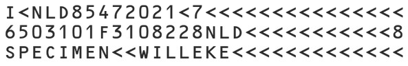
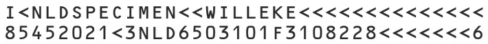

# iOS User Guide for MRZ Scanning

This user guide will walk through the [ScanMRZ](https://github.com/Dynamsoft/mrz-scanner-mobile/tree/main/ios/samples/ScanMRZ/) sample app. When creating your own project, please use this sample as a reference. This guide uses RTU (Ready to Use) APIs which aim to elevate the UI creation process with less code and offer a more pleasant and intuitive UI for your app.

## Supported Machine-Readable Travel Document Types

The Machine Readable Travel Document (MRTD) standard specified by the International Civil Aviation Organization (ICAO) defines how to encode information for optical character recognition on official travel documents.

Currently, the SDK supports three types of MRTD:

> [!NOTE] If you need support for other types of MRTDs, our SDK can be easily customized. Please contact the [Dynamsoft Support Team](https://www.dynamsoft.com/contact/) if you have such a request.

### ID (TD1 Size)

The MRZ (Machine Readable Zone) in TD1 format consists of 3 lines with 30 characters in each line.

<div>
   
</div>

### ID (TD2 Size)

The MRZ (Machine Readable Zone) in TD2 format consists of 2 lines with 36 characters in each line.

<div>
   
</div>

### Passport (TD3 Size)

The MRZ (Machine Readable Zone) in TD3 format consists of 2 lines with 44 characters in each line.

<div>
   
</div>

## Requirements

- Supported OS: **iOS 13** or higher.
- Supported ABI: **arm64** and **x86_64**.
- Development Environment: **Xcode 13** and above (**Xcode 14.1+** recommended).

## Add the SDK

There are two ways in which you can include the `DynamsoftMRZScanner` library in your app:

### Option 1: Add the xcframeworks via Swift Package Manager

1. In your Xcode project, go to **File --> AddPackages**.

2. In the top-right section of the window, search "https://github.com/Dynamsoft/mrz-scanner-spm"

3. Select `mrz-scanner-spm`, choose `Exact version`, enter **3.0.5000**, then click **Add Package**.

4. Check all the **xcframeworks** and add them.

### Option 2: Add the Frameworks via CocoaPods

1. Add the frameworks in your **Podfile**, replace `TargetName` with your real target name.

   ```sh
   target 'TargetName' do
      use_frameworks!

   pod 'DynamsoftMRZScannerBundle','3.0.5000'

   end
   ```

2. Execute the pod command to install the frameworks and generate workspace(**[TargetName].xcworkspace**):

   ```sh
   pod install
   ```

## Step 1: Create a New Project

The first thing that we are going to do is to create a fresh new project. Here are the steps on how to quickly do that

1. Open Xcode and select create a new project.

2. Select **iOS > App** for your application.

3. Input your product name (ScanMRZ), interface (StoryBoard) and select the language (Objective-C/Swift).

4. Click on the **Next** button and select the location to save the project.

5. Click on the **Create** button to finish.

## Step 2: Include the Library

Please read [Add the SDK](#add-the-sdk) section for instructions on how to add the SDK to your iOS application.

## Step 3: Initialize the License

The first major step in code configuration is to include a valid license in the `MRZScannerConfig`, which is used when launching the scanner. If you are just getting started with the MRZ Scanner from Dynamsoft, we recommend getting your own 30-day trial license through the following modal:



Let's break it down into two smaller steps:

1. In the *ViewController* code, there will be a single button that will start the operation and a label where the error message will be displayed should something go wrong during the capture process. In order to store the parsed MRZ information, we will also create a data struct with the necessary fields as show in the below code snippet.

   The first step in code configuration is to include a valid license in the `MRZScannerConfig` object, which is used when launching the scanner.

<div class="sample-code-prefix"></div>
>- Objective-C
>- Swift
>
>1. 
```objc
#import "ViewController.h"
#import <DynamsoftLicense/DynamsoftLicense.h>
#import <DynamsoftMRZScannerBundle/DynamsoftMRZScannerBundle.h>
#import <DynamsoftMRZScannerBundle/DynamsoftMRZScannerBundle-Swift.h>
@interface ViewController ()
@property (nonatomic, strong) UIButton *button;
@property (nonatomic, strong) UILabel *label;
@end
@implementation ViewController
- (void)viewDidLoad {
   [super viewDidLoad];
   [self setup];
}
- (void)buttonTapped {
   DSMRZScannerViewController *vc = [[DSMRZScannerViewController alloc] init];
   DSMRZScannerConfig *config = [[DSMRZScannerConfig alloc] init];
   config.license = @"DLS2eyJvcmdhbml6YXRpb25JRCI6IjIwMDAwMSJ9";
   vc.config = config;
}
- (void)setup {
   self.button = [UIButton buttonWithType:UIButtonTypeSystem];
   self.button.backgroundColor = [UIColor blackColor];
   [self.button setTitle:@"Scan MRZ" forState:UIControlStateNormal];
   [self.button setTitleColor:[UIColor whiteColor] forState:UIControlStateNormal];
   self.button.layer.cornerRadius = 8;
   self.button.clipsToBounds = YES;
   [self.button addTarget:self action:@selector(buttonTapped) forControlEvents:UIControlEventTouchUpInside];
   self.button.translatesAutoresizingMaskIntoConstraints = NO;
   [self.view addSubview:self.button];
   self.label = [[UILabel alloc] init];
   self.label.numberOfLines = 0;
   self.label.textColor = [UIColor blackColor];
   self.label.textAlignment = NSTextAlignmentCenter;
   self.label.font = [UIFont systemFontOfSize:20];
   self.label.translatesAutoresizingMaskIntoConstraints = NO;
   [self.view addSubview:self.label];
   UILayoutGuide *safeArea = self.view.safeAreaLayoutGuide;
   [NSLayoutConstraint activateConstraints:@[
          [self.button.centerXAnchor constraintEqualToAnchor:self.view.centerXAnchor],
          [self.button.topAnchor constraintEqualToAnchor:safeArea.topAnchor constant:50],
          [self.button.heightAnchor constraintEqualToConstant:50],
          [self.button.widthAnchor constraintEqualToConstant:150],
          [self.label.centerXAnchor constraintEqualToAnchor:safeArea.centerXAnchor],
          [self.label.centerYAnchor constraintEqualToAnchor:safeArea.centerYAnchor],
          [self.label.leadingAnchor constraintEqualToAnchor:safeArea.leadingAnchor constant:30],
          [self.label.trailingAnchor constraintEqualToAnchor:safeArea.trailingAnchor constant:-30]
   ]];
}
@end
```
2. 
```swift
import UIKit
import DynamsoftLicense
import DynamsoftMRZScannerBundle
class ViewController: UIViewController {
   let button = UIButton()
   let label = UILabel()
   override func viewDidLoad() {
          super.viewDidLoad()
          setup()
   }
   @objc func buttonTapped() {
          let vc = MRZScannerViewController()
          let config = MRZScannerConfig()
          config.license = "DLS2eyJvcmdhbml6YXRpb25JRCI6IjIwMDAwMSJ9"
          vc.config = config
   }      
   func setup() {
          button.backgroundColor = .black
          button.setTitle("Scan MRZ", for: .normal)
          button.setTitleColor(.white, for: .normal)
          button.layer.cornerRadius = 8
          button.clipsToBounds = true
          button.addTarget(self, action: #selector(buttonTapped), for: .touchUpInside)
          button.translatesAutoresizingMaskIntoConstraints = false
          view.addSubview(button)
          label.numberOfLines = 0
          label.textColor = .black
          label.textAlignment = .center
          label.font = UIFont.systemFont(ofSize: 20)
          label.translatesAutoresizingMaskIntoConstraints = false
          view.addSubview(label)
          let safeArea = view.safeAreaLayoutGuide
          NSLayoutConstraint.activate([
             button.centerXAnchor.constraint(equalTo: view.centerXAnchor),
             button.topAnchor.constraint(equalTo: safeArea.topAnchor, constant: 50),
             button.heightAnchor.constraint(equalToConstant: 50),
             button.widthAnchor.constraint(equalToConstant: 150),
             label.centerXAnchor.constraint(equalTo: safeArea.centerXAnchor),
             label.centerYAnchor.constraint(equalTo: safeArea.centerYAnchor),
             label.leadingAnchor.constraint(equalTo: safeArea.leadingAnchor, constant: 30),
             label.trailingAnchor.constraint(equalTo: safeArea.trailingAnchor, constant: -30)
          ])
   }
}
```

   > [!NOTE]  
   >
   >- The license string here grants a time-limited free trial which requires network connection to work.
   >- You can request a 30-day trial license via the [Request a Trial License](https://www.dynamsoft.com/customer/license/trialLicense?product=mrz&utm_source=guide&package=ios){:target="_blank"} link.
   >- The *setup* method is used to define the properties of the UI elements (label, button) via the code instead of configuring them via the storyboard. It is called in `viewDidLoad` to ensure that these settings are applied once the app is opened.

2. Configure *NavigationController*

   We will only have one *ViewController*, where most of the code will be written including the license initialization, along with an associated *NavigationController* to allow the user to navigate back and forth from the home page to the main *ViewController* where the MRZ Scanner will operate.

## Step 4: Implementing the MRZ Scanner

Now that the license is configured and set, it is time to implement the actions to take when an MRZ is scanned via the `onScannedResult` callback function. The callback function is triggered whenever an MRZ is scanned, so we must implement the code that will display the parsed MRZ information in the *label* that we previously defined.

Each result comes with a `DSResultStatus` that can be one of *finished*, *canceled*, or *exception*. The first, *finished*, indicates that the result has been parsed and is available - while *canceled* indicates that the operation has been halted. If *exception* is the result status, then that means that an error has occurred during the MRZ scanning process. So let us now continue the code of the `buttonTapped` method from step 3:

<div class="sample-code-prefix"></div>
>- Objective-C
>- Swift
>
>1. 
```objc
/* CONTINUATION OF CODE FROM STEP 3 */
- (void)buttonTapped {
   DSMRZScannerViewController *vc = [[DSMRZScannerViewController alloc] init];
   DSMRZScannerConfig *config = [[DSMRZScannerConfig alloc] init];
   config.license = @"DLS2eyJvcmdhbml6YXRpb25JRCI6IjIwMDAwMSJ9";
   // Extra configurations from step 5 go here
   vc.config = config;
   __weak typeof(self) weakSelf = self;
   vc.onScannedResult = ^(DSMRZScanResult *result) {
          switch (result.resultStatus) {
             case DSResultStatusFinished: {
                dispatch_async(dispatch_get_main_queue(), ^{
                   NSString *documentType = result.data.documentType ?: @"";
                   NSString *documentNumber = result.data.documentNumber ?: @"";
                   weakSelf.label.text = [NSString stringWithFormat:@"Result:\nDocumentType: %@\nDocumentNumber: %@", documentType, documentNumber];
                });
                break;
             }
             case DSResultStatusCanceled: {
                dispatch_async(dispatch_get_main_queue(), ^{
                   weakSelf.label.text = @"Scan canceled";
                });
                break;
             }
             case DSResultStatusException: {
                dispatch_async(dispatch_get_main_queue(), ^{
                   weakSelf.label.text = result.errorString;
                });
                break;
             }
             default:
                break;
          }
          dispatch_async(dispatch_get_main_queue(), ^{
             [weakSelf.navigationController popViewControllerAnimated:YES];
          });
   };
   dispatch_async(dispatch_get_main_queue(), ^{
          weakSelf.navigationController.navigationBar.hidden = YES;
          [weakSelf.navigationController pushViewController:vc animated:YES];
   });
}
```
2. 
```swift
/* CONTINUATION OF CODE FROM STEP 3 */
@objc func buttonTapped() {
   let vc = MRZScannerViewController()
   let config = MRZScannerConfig()
   config.license = "DLS2eyJvcmdhbml6YXRpb25JRCI6IjIwMDAwMSJ9"
   // Extra configurations from step 5 go here
   vc.config = config
   vc.onScannedResult = { [weak self] result in
          guard let self = self else { return }
          switch result.resultStatus {
          /* if the result is valid, display it in the label */
          case .finished:
             DispatchQueue.main.async {
                let documentType = result.data?.documentType ?? ""
                let documentNumber = result.data?.documentNumber ?? ""
                self.label.text = "Result:\nDocumentType: " + (documentType) + "\n" + "DocumentNumber: " + (documentNumber)
             }
          /* if the scan operation is canceled by the user */
          case .canceled:
             DispatchQueue.main.async {
                self.label.text = "Scan canceled"
             }
          /* if an error occurs during capture, display the error string in the label */
          case .exception:
             DispatchQueue.main.async {
                self.label.text = result.errorString
             }
          @unknown default:
             break
          }
          /* return back to the home page to display the result/cancel message/error string */
          DispatchQueue.main.async {
             self.navigationController?.popViewController(animated: true)
          }
   }
   /* when the button is clicked, hide the navigation bar and push the newly created MRZScannerViewController to the main view */
   DispatchQueue.main.async {
          self.navigationController?.navigationBar.isHidden = true
          self.navigationController?.pushViewController(vc, animated: true)
   }
}
```

## Step 5: Configure the MRZ Scanner (optional)

This next step, although optional, is highly recommended to help you achieve a smooth-looking UI. In this step, we will configure the `MRZScannerConfig` object to utilize some of the other properties that are available in the class. In step 3, `MRZScannerConfig` was initially used to configure the license. Now, let's use some of the other settings which include the document type, the visibility of the torch button, and whether a beep should be played after a successful recognition.

<div class="sample-code-prefix"></div>
>- Objective-C
>- Swift
>
>1. 
```objc
DSMRZScannerConfig *config = [[DSMRZScannerConfig alloc] init];
// You can use the following code to specify the document type.
config.documentType = DSDocumentTypePassport;
// If you have a customized template file, please put it under "DynamsoftResources.bundle\Templates\" and call the following code. You can also use a JSON string as the `templateFile`.
config.templateFile = @"CustomizedTemplate.json";
// Add the following line to enable the beep sound when an MRZ is scanned successfully.
config.isBeepEnabled = true;
// Add the following line if you don't want to display the torch button.
config.isTorchButtonVisible = false;
// Add the following line if you don't want to display the close button.
config.isCloseButtonVisible = false;
```
2. 
```swift
let config = MRZScannerConfig()
// You can use the following code to specify the document type.
config.documentType = .passport
// If you have a customized template file, please put it under "DynamsoftResources.bundle\Templates\" and call the following code. You can also use a JSON string as the `templateFile`.
config.templateFile = "CustomizedTemplate.json"
// Add the following line to enable the beep sound when an MRZ is scanned successfully.
config.isBeepEnabled = true
// Add the following line if you don't want to display the torch button.
config.isTorchButtonVisible = false
// Add the following line if you don't want to display the close button.
config.isCloseButtonVisible = false
```

> [!NOTE]
>The code above only shows the configuration of the MRZScannerConfig object, which takes place right at the beginning of the `buttonTapped` function in steps 3 and 4.

## Step 6: Run the Project

Now that the code has been written, it's time to run the project. The first thing that needs to be done is to configure the *Signing & Capabilities* section of the project. After you complete this section, move to the *Info* section of the project settings. In the *Info* section, please make sure that the "Privacy - Camera Usage Description" key is included in the list.

In order to run the project, you will require a physical iOS device. Once the device is connected, you should see it as an available device in top bar. After selecting the device from the menu, all you need to do is click the Run button. 

> [!NOTE] If you try running the project on a simulator, you will encounter errors as this sample uses the device camera which is unavailable when using the simulator.

## Conclusion

Now that your project is up and running you should be able to see a clean and simplified UI that contains all the necessary UI elements that are needed to make the MRZ scanning process as easy and intuitive for the user as it can be.

## Next Steps

If you have any questions in regards to the usage of the new specialized SDK, do not hesitate to get in touch with the [Dynamsoft Support Team](https://www.dynamsoft.com/contact/).
