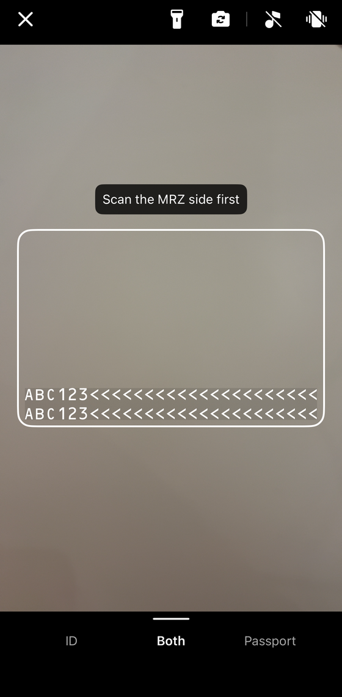
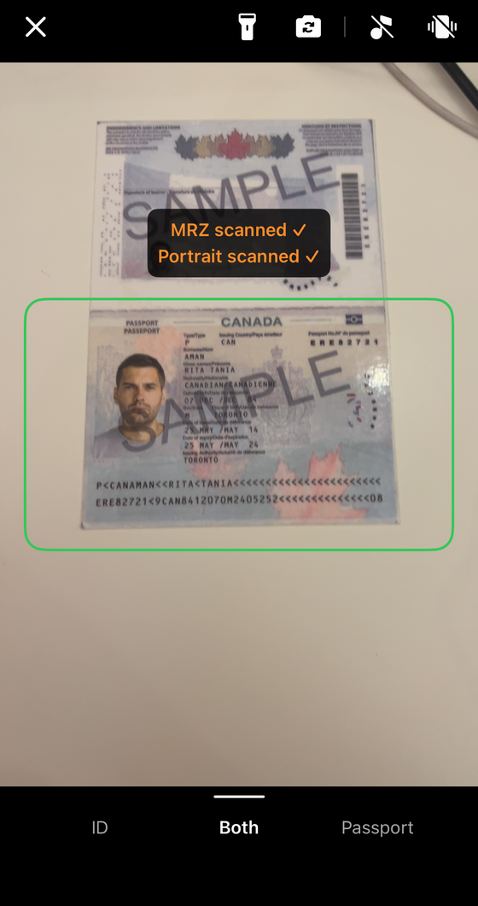
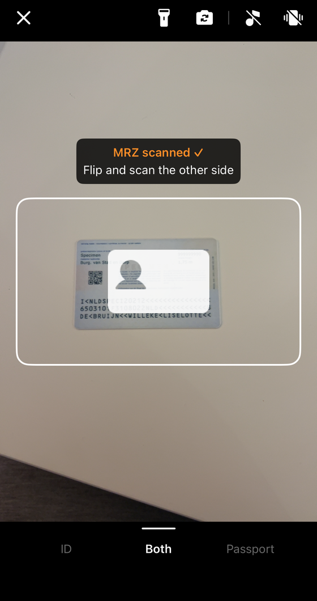

# MRZ Scanner User Guide (iOS Edition)

The Dynamsoft MRZ Scanner (iOS Edition) provides a ready-to-use scanning component that lets you add MRZ reading to your app with minimal setup. This guide walks through building an MRZ scanning app from scratch using `MRZScannerViewController` — the built-in view controller that handles the camera UI, scanning logic, and result delivery.

> [!TIP]
> The app built here is **ScanMRZBasic**, available on GitHub in [UIKit](https://github.com/Dynamsoft/mrz-scanner-mobile/tree/main/ios/samples/ScanMRZBasic) and [SwiftUI](https://github.com/Dynamsoft/mrz-scanner-mobile/tree/main/ios/samples/ScanMRZBasicSwiftUI). For a fuller app with a dedicated result screen, document images, and camera-permission recovery, see the [ScanMRZ Demo App](../samples/scanmrz-walkthrough.md).

> [!IMPORTANT]
> Upgrading an existing integration rather than starting fresh? See the [Upgrade Guide](upgrade.md) first.

## Supported Document Types

The SDK supports three ICAO Machine Readable Travel Document (MRTD) formats: **TD1** (ID cards, 3-line MRZ), **TD2** (ID cards, 2-line MRZ), and **TD3** (passports, 2-line MRZ). For a visual reference of each format, see [Supported Document Types](../../shared/supported-document-types.md).

> [!NOTE]
> To request support for other MRTD types, contact the [Dynamsoft Support Team](https://www.dynamsoft.com/contact/).

## System Requirements

- Supported OS: **iOS 13** or higher.
- Supported ABI: **arm64** and **x86_64**.
- Development Environment: **Xcode 13** and above (**Xcode 14.1+** recommended).
- Hardware: **a physical iOS device**. The iOS Simulator does not expose a camera, so the scanner cannot run on it.

## Licensing

A valid license key is required to use the SDK. If you are just getting started, request a free 30-day trial license below:



> [!NOTE]
>
> - The license string above grants a time-limited free trial which requires a network connection.
> - You can request a 30-day trial license via the [Request a Trial License](https://www.dynamsoft.com/customer/license/trialLicense?product=mrz&utm_source=guide&package=ios){:target="_blank"} link.
> - For production license setup, see the [License Activation](license-activation.md) guide.

## Add the SDK

You can include the `DynamsoftMRZScannerBundle` library in your app in two ways:

### Option 1: Add the xcframeworks via Swift Package Manager

1. In your Xcode project, go to **File > Add Packages**.

2. In the search field at the top right of the window, enter `https://github.com/Dynamsoft/mrz-scanner-spm`.

3. Select **mrz-scanner-spm**, choose **Exact Version**, enter **3.6.2000**, then click **Add Package**.

4. Check all the **xcframeworks** and add them.

### Option 2: Add the Frameworks via CocoaPods

1. Add the frameworks to your **Podfile**, replacing `TargetName` with your real target name:

   ```sh
   target 'TargetName' do
      use_frameworks!
      pod 'DynamsoftMRZScannerBundle', '3.6.2000'
   end
   ```

2. Run the pod command to install the frameworks and generate the workspace (**[TargetName].xcworkspace**):

   ```sh
   pod install
   ```

## Building the MRZ Scanner Application

The following steps build **ScanMRZBasic** — the smallest app that scans an MRZ and shows the parsed result. You can download the finished project from GitHub in [UIKit](https://github.com/Dynamsoft/mrz-scanner-mobile/tree/main/ios/samples/ScanMRZBasic) or [SwiftUI](https://github.com/Dynamsoft/mrz-scanner-mobile/tree/main/ios/samples/ScanMRZBasicSwiftUI).

The whole app is a single view controller: a button presents the scanner, and the result renders on the same screen. For a fuller app with a dedicated result screen, a document image switcher, per-field validation explanations, and camera-permission recovery, see the [ScanMRZ Demo App](../samples/scanmrz-walkthrough.md).

Before you start, have these ready:

- **A license key** — a trial key is embedded in the snippets below. See [Licensing](#licensing) to request your own.
- **A physical iOS device**, and an Apple ID signed in to Xcode. Step 7 covers signing if you have not set it up before.
- **A document to scan** — any passport or ID card carrying a TD1, TD2, or TD3 machine-readable zone. See [Supported Document Types](../../shared/supported-document-types.md) for what each format looks like.

> [!NOTE]
> The steps below build the UIKit version. If you prefer SwiftUI, follow Steps 1 through 3, then see [Using the Scanner from SwiftUI](../samples/swiftui-walkthrough.md) instead of Steps 4 through 6.

### Step 1: Create a New Project

1. Open Xcode and select **File > New > Project**.
2. Choose **iOS > App** as the project template.
3. Set the product name to *ScanMRZBasic*, set **Interface** to **Storyboard**, and set **Language** to **Swift** or **Objective-C**.
4. Delete **Main.storyboard** from the project navigator, choosing **Move to Trash**. This app builds its one screen in code.
5. Select the project in the navigator, open the **Info** tab for your target, and remove the **Main storyboard file base name** entry. Then expand **Application Scene Manifest > Scene Configuration > Application Session Role > Item 0** and remove **Storyboard Name**.

> [!NOTE]
> Step 5 matters: if either storyboard reference survives, the app launches looking for a storyboard that no longer exists. Leave the rest of the scene manifest alone — the **Delegate Class Name** entry is what connects your `SceneDelegate`, and without it the app opens to a black screen.

### Step 2: Add the SDK

Follow the instructions in the [Add the SDK](#add-the-sdk) section above to add `DynamsoftMRZScannerBundle` to your project.

### Step 3: Declare the Camera Usage Description

iOS requires every app that opens the camera to say why. Select your target, open the **Info** tab, and add the **Privacy - Camera Usage Description** key (`NSCameraUsageDescription`) with a short explanation, for example `This app uses the camera to scan MRZ documents.`

> [!IMPORTANT]
> This is not optional and it is not a permission prompt setting. Without this key the app **crashes** the moment the scanner tries to open the camera, on a build that otherwise succeeds. The string you write here is what iOS shows the user in its permission alert.

### Step 4: Set Up the Scene Delegate

With `Main.storyboard` gone, nothing creates a window, so `SceneDelegate` has to install the root view controller itself. Replace the `scene(_:willConnectTo:options:)` method with the following and delete the other stub methods Xcode generated.

<div class="sample-code-prefix"></div>
>- Objective-C
>- Swift
>
>1. 
```objc
#import "SceneDelegate.h"
#import "ViewController.h"
@implementation SceneDelegate
// With no storyboard, the one and only view controller becomes the root here. The
// scanner is presented on top of it rather than pushed, which is why there is no
// navigation controller either.
- (void)scene:(UIScene *)scene willConnectToSession:(UISceneSession *)session options:(UISceneConnectionOptions *)connectionOptions {
   if (![scene isKindOfClass:[UIWindowScene class]]) { return; }
   UIWindowScene *windowScene = (UIWindowScene *)scene;
   UIWindow *window = [[UIWindow alloc] initWithWindowScene:windowScene];
   window.rootViewController = [[ViewController alloc] init];
   self.window = window;
   [window makeKeyAndVisible];
}
@end
```
2. 
```swift
import UIKit
class SceneDelegate: UIResponder, UIWindowSceneDelegate {
   var window: UIWindow?
   // With no storyboard, the one and only view controller becomes the root here. The
   // scanner is presented on top of it rather than pushed, which is why there is no
   // navigation controller either.
   func scene(_ scene: UIScene, willConnectTo session: UISceneSession, options connectionOptions: UIScene.ConnectionOptions) {
      guard let windowScene = scene as? UIWindowScene else { return }
      let window = UIWindow(windowScene: windowScene)
      window.rootViewController = ViewController()
      self.window = window
      window.makeKeyAndVisible()
   }
}
```

### Step 5: Build the Screen

Open **ViewController** and replace its contents. The screen has two halves: a **Scan an MRZ** button pinned to the bottom, and a scrolling result area above it that stays hidden until a scan succeeds.

<div class="sample-code-prefix"></div>
>- Objective-C
>- Swift
>
>1. 
```objc
/* ViewController.h */
#import <UIKit/UIKit.h>
@interface ViewController : UIViewController
@end
/* ViewController.m */
#import "ViewController.h"
#import <DynamsoftMRZScannerBundle/DynamsoftMRZScannerBundle.h>
#import <DynamsoftMRZScannerBundle/DynamsoftMRZScannerBundle-Swift.h>
@interface ViewController ()
@property (nonatomic, strong) UIButton *scanButton;
// Carries the canceled message and any error string.
@property (nonatomic, strong) UILabel *statusLabel;
@property (nonatomic, strong) UIImageView *portraitView;
@property (nonatomic, strong) UIStackView *portraitRow;
// Holds the portrait and the field rows, rebuilt on every successful scan.
@property (nonatomic, strong) UIStackView *resultStack;
@end
// Amber (#FFC107) marks a value that does not match its check digit.
static UIColor *WarningAmber(void) {
   return [UIColor colorWithRed:1.0 green:193.0/255.0 blue:7.0/255.0 alpha:1.0];
}
@implementation ViewController
- (void)viewDidLoad {
   [super viewDidLoad];
   self.view.backgroundColor = [UIColor systemBackgroundColor];
   [self setupUI];
}
// Deliberately plain: a scroll view of results with the scan button pinned below it.
// Styling belongs in the ScanMRZ sample, not here.
- (void)setupUI {
   self.scanButton = [UIButton buttonWithType:UIButtonTypeSystem];
   [self.scanButton setTitle:@"Scan an MRZ" forState:UIControlStateNormal];
   self.scanButton.titleLabel.font = [UIFont systemFontOfSize:18];
   [self.scanButton setTitleColor:[UIColor whiteColor] forState:UIControlStateNormal];
   self.scanButton.backgroundColor = [UIColor systemBlueColor];
   self.scanButton.layer.cornerRadius = 8;
   [self.scanButton addTarget:self action:@selector(scanTapped) forControlEvents:UIControlEventTouchUpInside];
   self.statusLabel = [[UILabel alloc] init];
   self.statusLabel.font = [UIFont systemFontOfSize:16];
   self.statusLabel.numberOfLines = 0;
   self.statusLabel.hidden = YES;
   self.portraitView = [[UIImageView alloc] init];
   self.portraitView.contentMode = UIViewContentModeScaleAspectFit;
   // A trailing spacer keeps the portrait its own size at the leading edge.
   self.portraitRow = [[UIStackView alloc] init];
   [self.portraitRow addArrangedSubview:self.portraitView];
   [self.portraitRow addArrangedSubview:[[UIView alloc] init]];
   self.resultStack = [[UIStackView alloc] init];
   self.resultStack.axis = UILayoutConstraintAxisVertical;
   self.resultStack.spacing = 2;
   self.resultStack.hidden = YES;
   UIStackView *content = [[UIStackView alloc] initWithArrangedSubviews:@[self.statusLabel, self.resultStack]];
   content.axis = UILayoutConstraintAxisVertical;
   content.spacing = 16;
   content.translatesAutoresizingMaskIntoConstraints = NO;
   UIScrollView *scrollView = [[UIScrollView alloc] init];
   scrollView.translatesAutoresizingMaskIntoConstraints = NO;
   self.scanButton.translatesAutoresizingMaskIntoConstraints = NO;
   self.portraitView.translatesAutoresizingMaskIntoConstraints = NO;
   [scrollView addSubview:content];
   [self.view addSubview:scrollView];
   [self.view addSubview:self.scanButton];
   UILayoutGuide *safeArea = self.view.safeAreaLayoutGuide;
   UILayoutGuide *contentGuide = scrollView.contentLayoutGuide;
   UILayoutGuide *frameGuide = scrollView.frameLayoutGuide;
   [NSLayoutConstraint activateConstraints:@[
      [self.portraitView.widthAnchor constraintEqualToConstant:96],
      [self.portraitView.heightAnchor constraintEqualToConstant:128],
      [scrollView.topAnchor constraintEqualToAnchor:safeArea.topAnchor],
      [scrollView.leadingAnchor constraintEqualToAnchor:safeArea.leadingAnchor],
      [scrollView.trailingAnchor constraintEqualToAnchor:safeArea.trailingAnchor],
      [scrollView.bottomAnchor constraintEqualToAnchor:self.scanButton.topAnchor constant:-16],
      [content.topAnchor constraintEqualToAnchor:contentGuide.topAnchor constant:16],
      [content.bottomAnchor constraintEqualToAnchor:contentGuide.bottomAnchor constant:-16],
      [content.leadingAnchor constraintEqualToAnchor:frameGuide.leadingAnchor constant:16],
      [content.trailingAnchor constraintEqualToAnchor:frameGuide.trailingAnchor constant:-16],
      [self.scanButton.leadingAnchor constraintEqualToAnchor:safeArea.leadingAnchor constant:16],
      [self.scanButton.trailingAnchor constraintEqualToAnchor:safeArea.trailingAnchor constant:-16],
      [self.scanButton.bottomAnchor constraintEqualToAnchor:safeArea.bottomAnchor constant:-16],
      [self.scanButton.heightAnchor constraintEqualToConstant:50]
   ]];
}
@end
```
2. 
```swift
import UIKit
import DynamsoftMRZScannerBundle
import DynamsoftCaptureVisionBundle
class ViewController: UIViewController {
   // Amber (#FFC107) marks a value that does not match its check digit.
   private static let warningAmber = UIColor(red: 1, green: 193 / 255, blue: 7 / 255, alpha: 1)
   private let scanButton = UIButton(type: .system)
   // Carries the canceled message and any error string.
   private let statusLabel = UILabel()
   private let portraitView = UIImageView()
   private let portraitRow = UIStackView()
   // Holds the portrait and the field rows, rebuilt on every successful scan.
   private let resultStack = UIStackView()
   override func viewDidLoad() {
      super.viewDidLoad()
      view.backgroundColor = .systemBackground
      setupUI()
   }
   // Deliberately plain: a scroll view of results with the scan button pinned below it.
   // Styling belongs in the ScanMRZ sample, not here.
   private func setupUI() {
      scanButton.setTitle("Scan an MRZ", for: .normal)
      scanButton.titleLabel?.font = .systemFont(ofSize: 18)
      scanButton.setTitleColor(.white, for: .normal)
      scanButton.backgroundColor = .systemBlue
      scanButton.layer.cornerRadius = 8
      scanButton.addTarget(self, action: #selector(scanTapped), for: .touchUpInside)
      statusLabel.font = .systemFont(ofSize: 16)
      statusLabel.numberOfLines = 0
      statusLabel.isHidden = true
      portraitView.contentMode = .scaleAspectFit
      // A trailing spacer keeps the portrait its own size at the leading edge.
      portraitRow.addArrangedSubview(portraitView)
      portraitRow.addArrangedSubview(UIView())
      resultStack.axis = .vertical
      resultStack.spacing = 2
      resultStack.isHidden = true
      let content = UIStackView(arrangedSubviews: [statusLabel, resultStack])
      content.axis = .vertical
      content.spacing = 16
      content.translatesAutoresizingMaskIntoConstraints = false
      let scrollView = UIScrollView()
      scrollView.translatesAutoresizingMaskIntoConstraints = false
      scanButton.translatesAutoresizingMaskIntoConstraints = false
      portraitView.translatesAutoresizingMaskIntoConstraints = false
      scrollView.addSubview(content)
      view.addSubview(scrollView)
      view.addSubview(scanButton)
      let safeArea = view.safeAreaLayoutGuide
      let contentGuide = scrollView.contentLayoutGuide
      let frameGuide = scrollView.frameLayoutGuide
      NSLayoutConstraint.activate([
         portraitView.widthAnchor.constraint(equalToConstant: 96),
         portraitView.heightAnchor.constraint(equalToConstant: 128),
         scrollView.topAnchor.constraint(equalTo: safeArea.topAnchor),
         scrollView.leadingAnchor.constraint(equalTo: safeArea.leadingAnchor),
         scrollView.trailingAnchor.constraint(equalTo: safeArea.trailingAnchor),
         scrollView.bottomAnchor.constraint(equalTo: scanButton.topAnchor, constant: -16),
         content.topAnchor.constraint(equalTo: contentGuide.topAnchor, constant: 16),
         content.bottomAnchor.constraint(equalTo: contentGuide.bottomAnchor, constant: -16),
         content.leadingAnchor.constraint(equalTo: frameGuide.leadingAnchor, constant: 16),
         content.trailingAnchor.constraint(equalTo: frameGuide.trailingAnchor, constant: -16),
         scanButton.leadingAnchor.constraint(equalTo: safeArea.leadingAnchor, constant: 16),
         scanButton.trailingAnchor.constraint(equalTo: safeArea.trailingAnchor, constant: -16),
         scanButton.bottomAnchor.constraint(equalTo: safeArea.bottomAnchor, constant: -16),
         scanButton.heightAnchor.constraint(equalToConstant: 50)
      ])
   }
}
```

The project will not compile yet: the button targets a `scanTapped` method that Step 6 adds.

### Step 6: Launch the Scanner and Show the Result

Add the following to the same class. This is the rest of the application: it supplies the license, presents `MRZScannerViewController`, and handles whichever of the three result statuses comes back.

For optional config settings like document type filtering, UI visibility, and image capture, see the [Customize MRZ Scanner](customize-mrz-scanner.md) guide.

You do not need to write any camera-permission code. `MRZScannerViewController` checks the authorization status itself and never opens the camera without it. If access is unavailable the scanner shows an alert offering **Open Settings**, then reports the outcome as `.exception` with a readable error string.

> [!NOTE]
> To present your own permission UI instead, set `config.isCameraPermissionPromptEnabled = false`. The scanner then suppresses its alert but still reports the denial, and still never starts the camera without access. See [Customize MRZ Scanner](customize-mrz-scanner.md#handling-camera-permission) for the full flow.

<div class="sample-code-prefix"></div>
>- Objective-C
>- Swift
>
>1. 
```objc
/* Add to ViewController.m, inside @implementation ViewController */
- (void)scanTapped {
   DSMRZScannerConfig *config = [[DSMRZScannerConfig alloc] init];
   // A trial license, so it needs a network connection. Request your own at
   // https://www.dynamsoft.com/customer/license/trialLicense?product=mrz&utm_source=guide&package=ios
   config.license = @"DLS2eyJvcmdhbml6YXRpb25JRCI6IjIwMDAwMSJ9";
   DSMRZScannerViewController *scanner = [[DSMRZScannerViewController alloc] init];
   scanner.config = config;
   __weak typeof(self) weakSelf = self;
   // The result arrives off the main thread, so hop back before touching UIKit.
   // The scanner does not close itself, so dismissing it is the caller's job.
   scanner.onScannedResult = ^(DSMRZScanResult *result) {
      dispatch_async(dispatch_get_main_queue(), ^{
         [weakSelf dismissViewControllerAnimated:YES completion:nil];
         [weakSelf showResult:result];
      });
   };
   scanner.modalPresentationStyle = UIModalPresentationFullScreen;
   [self presentViewController:scanner animated:YES completion:nil];
}
// Renders one of the three result statuses the scanner can come back with.
- (void)showResult:(DSMRZScanResult *)result {
   switch (result.resultStatus) {
      case DSResultStatusFinished: {
         if (!result.data) { break; }
         // The portrait is returned by default, but is nil when none could be cropped.
         NSError *error = nil;
         UIImage *portrait = [[result getPortraitImage] toUIImage:&error];
         [self showData:result.data portrait:portrait];
         break;
      }
      case DSResultStatusCanceled:
         // The user closed the scanner. There is no data and nothing went wrong.
         [self showStatus:@"Scan canceled"];
         break;
      case DSResultStatusException:
         // The scanner asks for camera access itself, so a denial lands here as a
         // readable error string. This app needs no permission code of its own.
         [self showStatus:result.errorString ?: @""];
         break;
   }
}
- (void)showStatus:(NSString *)message {
   self.statusLabel.text = message;
   self.statusLabel.hidden = NO;
   self.resultStack.hidden = YES;
}
- (void)showData:(DSMRZData *)data portrait:(UIImage *)portrait {
   self.statusLabel.hidden = YES;
   self.resultStack.hidden = NO;
   for (UIView *v in self.resultStack.arrangedSubviews) { [v removeFromSuperview]; }
   if (portrait) {
      self.portraitView.image = portrait;
      [self.resultStack addArrangedSubview:self.portraitRow];
      [self.resultStack setCustomSpacing:16 afterView:self.portraitRow];
   }
   // Validation is per field, so a full name that joins two of them is flagged when
   // either half fails.
   DSValidationStatus firstNameStatus = [data getFieldValidationStatus:@"firstName"];
   DSValidationStatus nameStatus = firstNameStatus == DSValidationStatusFailed ? firstNameStatus : [data getFieldValidationStatus:@"lastName"];
   NSString *fullName = [[NSString stringWithFormat:@"%@ %@", data.firstName, data.lastName] stringByTrimmingCharactersInSet:[NSCharacterSet whitespaceCharacterSet]];
   [self addRow:@"Full Name" value:fullName status:nameStatus monospaced:NO];
   [self addRow:@"Document Number" value:data.documentNumber status:[data getFieldValidationStatus:@"documentNumber"] monospaced:NO];
   [self addRow:@"Nationality" value:data.nationality status:[data getFieldValidationStatus:@"nationality"] monospaced:NO];
   [self addRow:@"Date of Birth" value:data.dateOfBirth status:[data getFieldValidationStatus:@"dateOfBirth"] monospaced:NO];
   [self addRow:@"Date of Expiry" value:data.dateOfExpire status:[data getFieldValidationStatus:@"dateOfExpire"] monospaced:NO];
   // The document type comes from the MRZ layout itself, so it has no check digit.
   [self addRow:@"Document Type" value:data.documentType status:DSValidationStatusNone monospaced:NO];
   [self addRow:@"Raw MRZ Text" value:data.mrzText status:[data getFieldValidationStatus:@"mrzText"] monospaced:YES];
}
// Appends a caption and its value, or "N/A" when the parser extracted nothing. A
// value that failed its check digit is colored amber.
- (void)addRow:(NSString *)caption value:(NSString *)value status:(DSValidationStatus)status monospaced:(BOOL)monospaced {
   UILabel *captionLabel = [[UILabel alloc] init];
   captionLabel.text = caption;
   captionLabel.font = [UIFont systemFontOfSize:12];
   captionLabel.textColor = [UIColor secondaryLabelColor];
   UILabel *valueLabel = [[UILabel alloc] init];
   valueLabel.text = value.length == 0 ? @"N/A" : value;
   valueLabel.numberOfLines = 0;
   valueLabel.textColor = status == DSValidationStatusFailed ? WarningAmber() : [UIColor labelColor];
   valueLabel.font = monospaced ? [UIFont monospacedSystemFontOfSize:14 weight:UIFontWeightSemibold] : [UIFont boldSystemFontOfSize:16];
   [self.resultStack addArrangedSubview:captionLabel];
   [self.resultStack addArrangedSubview:valueLabel];
   [self.resultStack setCustomSpacing:12 afterView:valueLabel];
}
```
2. 
```swift
/* Add to ViewController.swift, inside class ViewController */
@objc private func scanTapped() {
   let config = MRZScannerConfig()
   // A trial license, so it needs a network connection. Request your own at
   // https://www.dynamsoft.com/customer/license/trialLicense?product=mrz&utm_source=guide&package=ios
   config.license = "DLS2eyJvcmdhbml6YXRpb25JRCI6IjIwMDAwMSJ9"
   let scanner = MRZScannerViewController()
   scanner.config = config
   // The result arrives off the main thread, so hop back before touching UIKit.
   // The scanner does not close itself, so dismissing it is the caller's job.
   scanner.onScannedResult = { [weak self] result in
      DispatchQueue.main.async {
         self?.dismiss(animated: true)
         self?.show(result)
      }
   }
   scanner.modalPresentationStyle = .fullScreen
   present(scanner, animated: true)
}
// Renders one of the three result statuses the scanner can come back with.
private func show(_ result: MRZScanResult) {
   switch result.resultStatus {
   case .finished:
      guard let data = result.data else { return }
      // The portrait is returned by default, but is nil when none could be cropped.
      show(data, portrait: try? result.getPortraitImage()?.toUIImage())
   case .canceled:
      // The user closed the scanner. There is no data and nothing went wrong.
      showStatus("Scan canceled")
   case .exception:
      // The scanner asks for camera access itself, so a denial lands here as a
      // readable error string. This app needs no permission code of its own.
      showStatus(result.errorString ?? "")
   @unknown default:
      break
   }
}
private func showStatus(_ message: String) {
   statusLabel.text = message
   statusLabel.isHidden = false
   resultStack.isHidden = true
}
private func show(_ data: MRZData, portrait: UIImage?) {
   statusLabel.isHidden = true
   resultStack.isHidden = false
   resultStack.arrangedSubviews.forEach { $0.removeFromSuperview() }
   if let portrait = portrait {
      portraitView.image = portrait
      resultStack.addArrangedSubview(portraitRow)
      resultStack.setCustomSpacing(16, after: portraitRow)
   }
   // Validation is per field, so a full name that joins two of them is flagged when
   // either half fails.
   let firstNameStatus = data.getFieldValidationStatus("firstName")
   let nameStatus = firstNameStatus == .failed ? firstNameStatus : data.getFieldValidationStatus("lastName")
   let fullName = "\(data.firstName) \(data.lastName)".trimmingCharacters(in: .whitespaces)
   addRow("Full Name", fullName, nameStatus)
   addRow("Document Number", data.documentNumber, data.getFieldValidationStatus("documentNumber"))
   addRow("Nationality", data.nationality, data.getFieldValidationStatus("nationality"))
   addRow("Date of Birth", data.dateOfBirth, data.getFieldValidationStatus("dateOfBirth"))
   addRow("Date of Expiry", data.dateOfExpire, data.getFieldValidationStatus("dateOfExpire"))
   // The document type comes from the MRZ layout itself, so it has no check digit.
   addRow("Document Type", data.documentType)
   addRow("Raw MRZ Text", data.mrzText, data.getFieldValidationStatus("mrzText"), monospaced: true)
}
// Appends a caption and its value, or "N/A" when the parser extracted nothing. A
// value that failed its check digit is colored amber.
private func addRow(_ caption: String, _ value: String, _ status: ValidationStatus = .none, monospaced: Bool = false) {
   let captionLabel = UILabel()
   captionLabel.text = caption
   captionLabel.font = .systemFont(ofSize: 12)
   captionLabel.textColor = .secondaryLabel
   let valueLabel = UILabel()
   valueLabel.text = value.isEmpty ? "N/A" : value
   valueLabel.numberOfLines = 0
   valueLabel.textColor = status == .failed ? Self.warningAmber : .label
   valueLabel.font = monospaced ? .monospacedSystemFont(ofSize: 14, weight: .semibold) : .boldSystemFont(ofSize: 16)
   resultStack.addArrangedSubview(captionLabel)
   resultStack.addArrangedSubview(valueLabel)
   resultStack.setCustomSpacing(12, after: valueLabel)
}
```

**Key APIs in use**

- **[`MRZScannerConfig`](../api-reference/mrz-scanner-config.md)** — carries your license and any optional settings. A fresh one is built on each tap here; holding a single instance and reusing it works just as well, since the scanner reads it when it starts.
- **[`MRZScannerViewController`](../api-reference/mrz-scanner-view-controller.md)** — the scanner itself. Assign `config`, assign `onScannedResult`, then present it. It supplies its own full-screen camera UI, so nothing you wrote above appears while scanning.
- **[`onScannedResult`](../api-reference/mrz-scanner-view-controller.md#onscannedresult)** — one callback for all three outcomes, called once per presentation. Two things about it shape the code above: it arrives **off the main thread**, and the scanner **does not close itself**.
- **[`resultStatus`](../api-reference/mrz-scan-result.md#resultstatus)** — one of `.finished`, `.canceled`, or `.exception`. Handle all three: cancellation and failure are reported through the same path as success rather than thrown, so a scanner that seems to produce nothing is usually an unhandled status rather than a crash.
- **[`errorString`](../api-reference/mrz-scan-result.md#errorstring)** — a readable message that accompanies `.exception`. [`errorCode`](../api-reference/mrz-scan-result.md#errorcode) gives the machine-readable code behind it.
- **[`data`](../api-reference/mrz-scan-result.md#data)** — the parsed [`MRZData`](../api-reference/mrz-data.md), holding every field read from the document. It is `nil` for the other two statuses, which is why the code unwraps it.
- **[`getPortraitImage()`](../api-reference/mrz-scan-result.md#getportraitimage)** — the portrait cropped from the document, or `nil` when none was found. `toUIImage()` throws, so it is called with `try?`.

**Reading a field's validation status**

Most MRZ fields are protected by a check digit, and [`getFieldValidationStatus`](../api-reference/mrz-data.md#getfieldvalidationstatus) reports whether the value read from the document matched it. It takes the same field names as the properties on `MRZData`:

```swift
addRow("Document Number", data.documentNumber,
       data.getFieldValidationStatus("documentNumber"))
```

The result is `.succeeded`, `.none` when the field carries no check digit, or `.failed` when the value and its check digit disagree — meaning the document may be misread, invalid, or altered. `addRow` colors the row amber in that case. Note that the value is still returned either way, so you can decide whether to accept it, prompt for a re-scan, or ask for manual correction.

The full name is the one field that needs two lookups, because the single line on screen joins two separately validated fields:

```swift
let firstNameStatus = data.getFieldValidationStatus("firstName")
let nameStatus = firstNameStatus == .failed
    ? firstNameStatus
    : data.getFieldValidationStatus("lastName")
```

The displayed line should be flagged if either half failed, so a failed `firstName` is used when present, and the status of `lastName` otherwise. Document type is left at the default `.none`, since it is derived from the MRZ layout itself rather than read from a field with a check digit.

> [!TIP]
> The [ScanMRZ Demo App](../samples/scanmrz-walkthrough.md) shows a richer treatment of the same API: an error icon, an underline marking the row as tappable, and a dialog explaining what a failed check digit means.

### Step 7: Run the Project

Before running, complete these steps:

1. **Configure signing** — Select the project in the navigator, open the **Signing & Capabilities** tab, and set a valid **Team**. Without this the project will not build for a device.

2. **Connect your device** — Plug in a physical iOS device and unlock it. The first time, you will need to trust the computer on the device, and trust your developer certificate under **Settings > General > VPN & Device Management**.

3. **Select your device** — Choose it from the run destination menu at the top of the Xcode window.

4. **Click Run.**

Tap **Scan an MRZ** and point the camera at the machine-readable zone of a passport or ID card. The scanner closes as soon as it has what it needs, and the parsed fields appear on the screen underneath.

> [!NOTE]
> A physical iOS device is required. The camera is not available in the iOS Simulator, so the scanner cannot run there.

## Results and Image Lifetime

The scanner is a view controller you present, which shapes how results reach you and what you can do with the images in them.

### How the result arrives

`onScannedResult` is a closure you assign to the instance you are about to present — not a delegate protocol, and not something you register in advance. Three things follow from that:

- **It is called off the main thread.** Dispatch to the main queue before touching UIKit or SwiftUI state. Every sample does this, and it is the most common source of trouble in a first integration.
- **The scanner does not close itself.** Dismiss or pop it from the callback. Nothing else will, so a missing dismissal leaves the camera on screen after a successful scan.
- **All three statuses arrive here.** Success, cancellation, and failure share one path; nothing is thrown and there is no separate error callback. A scan that appears to do nothing is usually an unhandled `resultStatus` rather than a crash.

The config is read when the scanner starts, so it makes no difference whether you create a fresh `MRZScannerViewController` for each scan or reuse one. `ScanMRZBasic` creates one on each tap, which keeps the license and settings in a single place; holding one and re-presenting it also works, since the scanner resets its own scan state each time it appears.

### How long the images stay valid

`getDocumentImage(_:)`, `getOriginalImage(_:)` and `getPortraitImage()` return `ImageData`, an ordinary Objective-C object whose pixels live in an `NSData` property. It is reference-counted by ARC like anything else, which means:

- The images stay valid as long as you hold the `MRZScanResult` or the `ImageData` itself.
- There is nothing to retain or release by hand, and no window in which they expire.
- Reading them before or after dispatching to the main queue is equally fine.

Call `toUIImage()` when you want a `UIImage` — to display in an image view, or to keep independently of the result:

```swift
if let portrait = try? result.getPortraitImage()?.toUIImage() {
    // An ordinary UIImage, no longer tied to the result.
}
```

`toUIImage()` throws when the pixel format cannot be converted, which is why the samples call it with `try?`.

What is worth planning for is **size**, not lifetime. `ImageData` holds uncompressed pixels at capture resolution rather than an encoded JPEG, and `returnOriginalImage` produces one full frame per document side. Leave it `false` unless you need the uncropped frame, and convert or discard what you receive rather than accumulating whole results.

> [!NOTE]
> This differs from Android, where the same getters return images backed by native buffers with their own reference counting. iOS has no equivalent mechanism and nothing corresponding to Android's `retainAllImageInstances()`.

## The Scanner Screen

`MRZScannerViewController` supplies its own full-screen UI, so nothing you wrote above controls what the user sees while scanning. It is worth knowing what that UI already tells them, because it decides how much your own screens still need to explain.

The screen is a live camera preview with a **guide frame** marking where to place the document, a **toolbar** across the top carrying the close, torch, camera-toggle, beep, and vibrate buttons, a **format selector** along the bottom for choosing between ID, passport, or both, and a **prompt** that updates as the scan progresses. Every one of these can be hidden — see [Configure the UI Elements](customize-mrz-scanner.md#configure-the-ui-elements).

<div align="center">
    <p></p>
    <p>The scanner waiting for a document</p>
</div>

### What the user is told

The scanner narrates its own progress, so the prompt text is the main thing a user follows:

| Stage | On screen |
| ----- | --------- |
| Waiting for a document | **Scan the MRZ side first** |
| Text lines detected in frame | A spinner at the center of the guide frame |
| MRZ read, nothing further needed | **MRZ scanned ✓** |
| MRZ read, portrait found on the same side | **MRZ scanned ✓ / Portrait scanned ✓** |
| MRZ read, still looking for a portrait | **MRZ scanned ✓ / Finding portrait...** |
| No portrait found after five seconds | **MRZ scanned ✓ / No portrait detected** |
| MRZ read, opposite side needed | **MRZ scanned ✓ / Flip and scan the other side**, with an animated flip prompt |
| Both sides captured | **MRZ scanned ✓ / Both sides scanned ✓** |

The confirmed lines are drawn in amber above the frame, and the frame border turns green at the same moment:

<div align="center">
    <p></p>
    <p>A completed single-side scan</p>
</div>

The border stays green through the handover when the scanner is about to return a result. It reverts to white only in the states where scanning continues — while a portrait is still being looked for, or while the user is being asked to flip the document.

The spinner is not a generic busy indicator. It is driven by per-frame text-line detection, so it appears when the scanner can see MRZ-like text and is working on it, and disappears when the document moves out of frame. Once the MRZ is confirmed it stops for the rest of the session. For the user it is the cue that holding the device steady is paying off.

> [!NOTE]
> The prompt is hidden along with the guide frame, since it reads as a label on it. Hiding the frame also widens the scanned area to the whole preview — see [Hiding the guide frame](customize-mrz-scanner.md#hiding-the-guide-frame).

The last four rows are covered in detail in the next section.

## Scanning Two-Sided Documents

On a passport the machine-readable zone and the portrait share one page, so a single capture collects everything. On most TD1 and TD2 ID cards they are on opposite sides, and the scanner has to see both. It handles this itself — the app you built above needs no extra code — but it changes what the scan looks like to the user and what comes back in the result.

The scanner always reads the **MRZ side first**, whichever physical side that is. The API names the sides `.mrz` and `.opposite` for that reason: document layouts vary by country, so there is no guarantee the MRZ is on the back or that the portrait is on the front.

### What happens during a scan

1. The user scans the MRZ side. This fills the images returned for `.mrz`.
2. The scanner looks for a portrait on that same side. If it finds one — the usual case for a passport — the scan ends there and **`.opposite` stays `nil`**.
3. If no portrait is found and the document is not a passport, the scanner shows **"Flip and scan the other side"** with an animated flip prompt. Once the opposite side is captured, its images fill `.opposite` and the portrait is taken from it.

<div align="center">
    <p></p>
    <p>The flip prompt on a two-sided ID card</p>
</div>

A passport that yields no portrait is treated differently: the scanner keeps looking on the same page rather than asking for a flip, since flipping a passport would not help. The document is recognized as a passport from its MRZ layout, so this decision needs nothing from you.

> [!NOTE]
> Five seconds after the scanner starts waiting for a portrait, the prompt changes to **"No portrait detected"** and a tappable **"Continue scanning or tap to finish →"** label appears below the guide frame. It lets the user finish with whatever has been captured so far, which is the way out when a document has no portrait to find. Ending the scan this way leaves `.opposite` and the portrait `nil`, so treat both as optional in your result handling.

### What you get back

Assuming default settings:

| Document | `getDocumentImage(.mrz)` | `getDocumentImage(.opposite)` | `getPortraitImage()` |
| -------- | ------------------------ | ----------------------------- | -------------------- |
| Passport (TD3) | populated | `nil` | populated, from the MRZ side |
| ID card (TD1 / TD2) | populated | populated | populated, from the opposite side |
| Any document, with `returnPortraitImage = false` | populated | `nil` | `nil` |

The same pattern applies to `getOriginalImage(_:)` once `returnOriginalImage` is set to `true`.

### Turning it off

Two-sided scanning is driven entirely by the portrait. It is on by default because `returnPortraitImage` defaults to `true`; setting it to `false` ends every scan as soon as the MRZ is read:

<div class="sample-code-prefix"></div>
>- Objective-C
>- Swift
>
>1. 
```objc
config.returnPortraitImage = NO;
```
2. 
```swift
config.returnPortraitImage = false
```

That is the right choice when you only need the parsed text, and it makes every scan a single capture. `getPortraitImage()` and `getDocumentImage(.opposite)` then always return `nil`.

For an example that displays the document images from both sides, see the [ScanMRZ Demo App](../samples/scanmrz-walkthrough.md).

## Preparing for Release

Two things are worth knowing before you ship a build that includes the scanner: what it adds to your app's size, and what its privacy manifests declare on your behalf.

### App size

Most of the footprint is the Dynamsoft Capture Vision engine and its models, not the MRZ layer. Measured from a device build of `ScanMRZBasic`:

| Component | Size |
| --------- | ---- |
| `DynamsoftCaptureVisionBundle.framework` | ~12 MB |
| — the engine binary | ~10 MB |
| — parser resources and character tables | ~1.7 MB |
| `DynamsoftMRZScannerBundle.framework` | ~3.3 MB |
| — the MRZ Core ML models | ~2.9 MB |
| — the scanner binary, assets, and template | ~0.4 MB |
| Your own code | negligible |
| **Total app** | **~16 MB** |

Since the frameworks are prebuilt binaries, a Release archive comes out close to this — almost none of the total is your own compiled code.

Android's ABI filtering has no counterpart here. Each xcframework's device slice is **arm64 only**, so an App Store build already carries a single architecture. The simulator slice lives in the xcframework but is never embedded in a device build or an archive.

### Privacy manifests

Both frameworks ship an Apple privacy manifest, and both are embedded automatically when you integrate through Swift Package Manager or CocoaPods:

```
Frameworks/DynamsoftCaptureVisionBundle.framework/PrivacyInfo.xcprivacy
Frameworks/DynamsoftMRZScannerBundle.framework/PrivacyInfo.xcprivacy
```

There is nothing to add, but there is something to be consistent with. Each manifest declares:

- **Accessed API categories** — disk space and file timestamps, with Apple's required reason codes.
- **Collected data types** — device ID and other usage data, both marked as **not** used for tracking.
- **`NSPrivacyTracking: false`**, and no tracking domains.

Your App Store privacy answers cover your whole app, SDKs included, so they need to agree with those declarations. If you copy the frameworks into your project by hand rather than letting the package manager embed them, make sure the `.xcprivacy` files come along — App Store Connect reads them from inside each framework bundle.

### What you do not need to configure

- **No symbol-stripping or obfuscation rules.** Android needs ProGuard rules kept so the native bindings survive R8; the iOS frameworks are prebuilt binaries, so your app's stripping and optimization settings do not reach inside them.
- **No bitcode.** Apple deprecated it in Xcode 14 and App Store Connect no longer accepts it. Neither framework contains a bitcode segment.
- **No camera entitlement.** The camera needs the usage description string from [Step 3](#step-3-declare-the-camera-usage-description), not a capability or entitlement.

## Next Steps

- **Demo app** — Work through the [ScanMRZ Demo App](../samples/scanmrz-walkthrough.md) to add a dedicated result screen, a document image switcher, per-field validation explanations, and camera-permission recovery.
- **SwiftUI** — [Using the Scanner from SwiftUI](../samples/swiftui-walkthrough.md) covers the `UIViewControllerRepresentable` bridge and both SwiftUI samples.
- **Samples** — Browse all four iOS samples on the [Demo and Samples](../samples/index.md) page.
- **Customize** — Learn how to configure document type, UI elements, and feedback in the [Customize MRZ Scanner](customize-mrz-scanner.md) guide.
- **API Reference** — Browse the full [iOS API Reference](../api-reference/index.md) for all classes and methods.
- **License** — See the [License Activation](license-activation.md) guide for production license setup.
- **Support** — Contact the [Dynamsoft Support Team](https://www.dynamsoft.com/contact/) for help or custom requirements.
