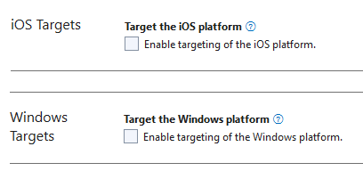

# MRZ Scanner User Guide (MAUI Edition)

The Dynamsoft MRZ Scanner (MAUI Edition) provides a ready-to-use scanning component that lets you add MRZ reading to your app with minimal setup. This guide walks through building a complete MRZ scanning app from scratch using `MRZScanner` — the built-in component that handles the camera UI, scanning logic, and result delivery.

> [!IMPORTANT]
> For the full sample code, visit the [ScanMRZ-Maui sample on GitHub](https://github.com/Dynamsoft/mrz-scanner-mobile-maui/tree/main/ScanMRZ).

## Supported Document Types

The SDK supports three ICAO Machine Readable Travel Document (MRTD) formats: **TD1** (ID cards, 3-line MRZ), **TD2** (ID cards, 2-line MRZ), and **TD3** (passports, 2-line MRZ). For a visual reference of each format, see [Supported Document Types](../../shared/supported-document-types.md).

> [!NOTE]
> For support for other MRTD types, contact the [Dynamsoft Support Team](https://www.dynamsoft.com/contact/).

## System Requirements

### .NET

- 10.0

### Android

- Supported OS: **Android 5.0** (API Level 21) or higher
- Supported ABI: **armeabi-v7a**, **arm64-v8a**, **x86** and **x86_64**

### iOS

- Supported OS: **iOS 15.0** or higher
- Supported ABI: **arm64** and **x86_64**

### Development Environment

- **Windows**: Visual Studio 2022 (v17.8 or higher) with the **.NET MAUI** workload installed.
- **Mac**: Visual Studio Code with the **.NET MAUI** extension (Xcode 26 or higher required for iOS builds with .NET 10)

> [!NOTE]
> Visual Studio for Mac is deprecated and no longer supported. Mac users should use Visual Studio Code with the .NET MAUI extension.

## Licensing

A valid license key is required to use the SDK. If you are just getting started, request a free 30-day trial license below:



> [!NOTE]
>
> - The license string above grants a time-limited free trial which requires a network connection.
> - You can request a 30-day trial license via the [Request a Trial License](https://www.dynamsoft.com/customer/license/trialLicense?product=mrz&utm_source=guide&package=maui){:target="_blank"} link.
> - For production license setup, see the [License Activation](license-activation.md) guide.

## Including the Library

### Visual Studio Code for Mac

Once the MAUI app is initialized in Visual Studio Code, the easiest way to include the library is to use the .NET CLI in the terminal. All you need to do is 

1. Open the Terminal in Visual Studio Code
2. Navigate to the project root directory (please note this is the folder that is in the same directory as <Project Name>.sln)
3. Run the following command `dotnet add package Dynamsoft.MRZScannerBundle.Maui --version 3.4.1310`

If the installation is successful, you should see the following line in the *.csproj* file

```xml
<PackageReference Include="Dynamsoft.MRZScannerBundle.Maui" Version="3.4.1310" />
```

When the project is built, the package will be downloaded and installed.

> [!IMPORTANT]
> Please note that the default MAUI app configuration includes the Windows and Mac Catalyst platforms. The Dynamsoft MRZ Scanner MAUI library currently only supports iOS and Android.
>
> **Please remove the Windows and Mac Catalyst platforms from the `<TargetFrameworks>` of the *.csproj* to avoid build errors.**


> [!TIP]
> To learn fully about how to use Visual Studio Code to create a new .NET MAUI project, please visit this [guide](https://learn.microsoft.com/en-us/dotnet/maui/get-started/first-app?view=net-maui-10.0&tabs=visual-studio-code&pivots=devices-ios) by Microsoft.


### Visual Studio for Windows

You need to add the library via the project file and complete additional steps for the installation.

1. Add the library in the project file:

    ```xml
    <Project Sdk="Microsoft.NET.Sdk">
        ...
        <ItemGroup>
            ...
            <PackageReference Include="Dynamsoft.MRZScannerBundle.Maui" Version="3.4.1310" />
        </ItemGroup>
    </Project>
    ```

2. Open the **Package Manager Console** and run the following command:

    ```bash
    dotnet build
    ```

> [!IMPORTANT]
>
> Windows system paths have a limitation of 260 characters. If the console is not used to install the package, you will receive an error saying
> 
> `Could not find a part of the path 'C:\Users\admin\.nuget\packages\dynamsoft.imageprocessing.ios\2.4.200\lib\net7.0-ios16.1\Dynamsoft.ImageProcessing.iOS.resources\DynamsoftImageProcessing.xcframework\ios-arm64\dSYMs\DynamsoftImageProcessing.framework.dSYM\Contents\Resources\DWARF\DynamsoftImageProcessing'`
>
> 
> The library only support the iOS and Android platforms. Be sure that you remove the other platforms like Windows, maccatalyst, etc.

## Building the MRZ Scanner Application

The following steps build the **ScanMRZ** sample app. You can also download the complete project from the [GitHub repo](https://github.com/Dynamsoft/mrz-scanner-mobile-maui/tree/main/ScanMRZ).

### Step 1: Create a New Project

If you are new to .NET MAUI, follow the [.NET MAUI installation guide](https://learn.microsoft.com/en-us/dotnet/maui/get-started/installation) to set up your development environment first.

#### Visual Studio (Windows)

1. Open Visual Studio and select **Create a new project**.
2. Select **.NET MAUI App** and click **Next**.
3. Name the project **ScanMRZ**, choose a location, and click **Next**.
4. Select **.NET 10.0** and click **Create**.

#### Visual Studio Code (Mac)

Follow the instructions provided by Microsoft [here](https://learn.microsoft.com/en-us/dotnet/maui/get-started/first-app?view=net-maui-10.0&tabs=visual-studio-code&pivots=devices-ios#create-an-app-1) to create a new .NET MAUI app in Visual Studio Code.

> [!NOTE]
> **ScanMRZ** is the project name used throughout this guide, but it is not a requirement.

> [!TIP]
> This guide uses .NET 10, but you can use .NET 8 or 9. Check which versions are currently supported on the [.NET releases page](https://learn.microsoft.com/en-us/dotnet/core/releases-and-support).

### Step 2: Add the SDK

Follow the instructions in the [Including the Library](#including-the-library) section above to add `Dynamsoft.MRZScannerBundle.Maui` to your project.

### Step 3: Set Up the UI

Edit **MainPage.xaml** to create the main page layout. It contains a **Scan MRZ** button anchored to the bottom, a status label shown on cancel or error, and a scrollable result view (hidden initially) that displays the scan results.

```xml
<?xml version="1.0" encoding="utf-8" ?>
<ContentPage xmlns="http://schemas.microsoft.com/dotnet/2021/maui"
             xmlns:x="http://schemas.microsoft.com/winfx/2009/xaml"
             x:Class="ScanMRZ.MainPage"
             BackgroundColor="#1A1A1A">

    <Grid RowDefinitions="*,Auto" Padding="0">

        <!-- Result content, hidden initially -->
        <ScrollView Grid.Row="0" x:Name="ResultView" IsVisible="False">
            <VerticalStackLayout Padding="20,20,20,10" Spacing="0">

                <!-- Header: Name, Info, Portrait -->
                <Grid ColumnDefinitions="*,Auto" Margin="0,0,0,20">
                    <VerticalStackLayout Grid.Column="0" VerticalOptions="Center" Spacing="4">
                        <Label x:Name="LblName" FontSize="22" FontAttributes="Bold" TextColor="White" />
                        <Label x:Name="LblSexAge" FontSize="14" TextColor="#AAAAAA" />
                        <Label x:Name="LblExpiry" FontSize="14" TextColor="#AAAAAA" />
                    </VerticalStackLayout>
                    <Border Grid.Column="1" StrokeShape="RoundRectangle 8"
                            Stroke="#333333" BackgroundColor="#2A2A2A"
                            WidthRequest="70" HeightRequest="70">
                        <Image x:Name="ImgPortrait" Aspect="AspectFill">
                            <Image.GestureRecognizers>
                                <PointerGestureRecognizer PointerPressed="OnImagePointerPressed" PointerReleased="OnImagePointerReleased" />
                            </Image.GestureRecognizers>
                        </Image>
                    </Border>
                </Grid>

                <!-- Tabs: Processed / Original -->
                <Grid ColumnDefinitions="*,*" Margin="0,0,0,16">
                    <Button x:Name="BtnProcessed" Text="Processed"
                            Clicked="OnProcessedTab"
                            BackgroundColor="Transparent" TextColor="White"
                            FontAttributes="Bold" FontSize="14"
                            BorderWidth="0" CornerRadius="0" />
                    <Button x:Name="BtnOriginal" Text="Original" Grid.Column="1"
                            Clicked="OnOriginalTab"
                            BackgroundColor="Transparent" TextColor="#888888"
                            FontAttributes="None" FontSize="14"
                            BorderWidth="0" CornerRadius="0" />
                </Grid>
                <!-- Tab underline -->
                <Grid ColumnDefinitions="*,*" HeightRequest="2" Margin="0,0,0,16">
                    <Border x:Name="UnderlineProcessed" BackgroundColor="White" StrokeThickness="0" />
                    <Border x:Name="UnderlineOriginal" Grid.Column="1" BackgroundColor="Transparent" StrokeThickness="0" />
                </Grid>

                <!-- Document Images (Processed) -->
                <Grid x:Name="ProcessedImages" ColumnDefinitions="*,*" ColumnSpacing="12" Margin="0,0,0,20"
                      HeightRequest="140" IsVisible="True">
                    <Border x:Name="BorderMrzProcessed" StrokeThickness="0" BackgroundColor="Transparent">
                        <Image x:Name="ImgMrzProcessed" Aspect="AspectFit">
                            <Image.GestureRecognizers>
                                <PointerGestureRecognizer PointerPressed="OnImagePointerPressed" PointerReleased="OnImagePointerReleased" />
                            </Image.GestureRecognizers>
                        </Image>
                    </Border>
                    <Border x:Name="BorderOppositeProcessed" Grid.Column="1" StrokeThickness="0" BackgroundColor="Transparent">
                        <Image x:Name="ImgOppositeProcessed" Aspect="AspectFit">
                            <Image.GestureRecognizers>
                                <PointerGestureRecognizer PointerPressed="OnImagePointerPressed" PointerReleased="OnImagePointerReleased" />
                            </Image.GestureRecognizers>
                        </Image>
                    </Border>
                </Grid>

                <!-- Document Images (Original) -->
                <Grid x:Name="OriginalImages" ColumnDefinitions="*,*" ColumnSpacing="12" Margin="0,0,0,20"
                      HeightRequest="140" IsVisible="False">
                    <Border x:Name="BorderMrzOriginal" StrokeThickness="0" BackgroundColor="Transparent">
                        <Image x:Name="ImgMrzOriginal" Aspect="AspectFit">
                            <Image.GestureRecognizers>
                                <PointerGestureRecognizer PointerPressed="OnImagePointerPressed" PointerReleased="OnImagePointerReleased" />
                            </Image.GestureRecognizers>
                        </Image>
                    </Border>
                    <Border x:Name="BorderOppositeOriginal" Grid.Column="1" StrokeThickness="0" BackgroundColor="Transparent">
                        <Image x:Name="ImgOppositeOriginal" Aspect="AspectFit">
                            <Image.GestureRecognizers>
                                <PointerGestureRecognizer PointerPressed="OnImagePointerPressed" PointerReleased="OnImagePointerReleased" />
                            </Image.GestureRecognizers>
                        </Image>
                    </Border>
                </Grid>

                <!-- Personal Info -->
                <Label Text="Personal Info" TextColor="White" FontSize="16" FontAttributes="Bold" Margin="0,0,0,10" />
                <BoxView HeightRequest="1" BackgroundColor="#333333" />
                <Grid ColumnDefinitions="*,*" Padding="0,10">
                    <Label Text="Given Name" TextColor="#AAAAAA" FontSize="14" />
                    <Label x:Name="ValGivenName" Grid.Column="1" TextColor="White" FontSize="14" />
                </Grid>
                <BoxView HeightRequest="1" BackgroundColor="#333333" />
                <Grid ColumnDefinitions="*,*" Padding="0,10">
                    <Label Text="Surname" TextColor="#AAAAAA" FontSize="14" />
                    <Label x:Name="ValSurname" Grid.Column="1" TextColor="White" FontSize="14" />
                </Grid>
                <BoxView HeightRequest="1" BackgroundColor="#333333" />
                <Grid ColumnDefinitions="*,*" Padding="0,10">
                    <Label Text="Date of Birth" TextColor="#AAAAAA" FontSize="14" />
                    <Label x:Name="ValDob" Grid.Column="1" TextColor="White" FontSize="14" />
                </Grid>
                <BoxView HeightRequest="1" BackgroundColor="#333333" />
                <Grid ColumnDefinitions="*,*" Padding="0,10">
                    <Label Text="Gender" TextColor="#AAAAAA" FontSize="14" />
                    <Label x:Name="ValGender" Grid.Column="1" TextColor="White" FontSize="14" />
                </Grid>
                <BoxView HeightRequest="1" BackgroundColor="#333333" />
                <Grid ColumnDefinitions="*,*" Padding="0,10">
                    <Label Text="Nationality" TextColor="#AAAAAA" FontSize="14" />
                    <Label x:Name="ValNationality" Grid.Column="1" TextColor="White" FontSize="14" />
                </Grid>
                <BoxView HeightRequest="1" BackgroundColor="#333333" Margin="0,0,0,20" />

                <!-- Document Info -->
                <Label Text="Document Info" TextColor="White" FontSize="16" FontAttributes="Bold" Margin="0,0,0,10" />
                <BoxView HeightRequest="1" BackgroundColor="#333333" />
                <Grid ColumnDefinitions="*,*" Padding="0,10">
                    <Label Text="Doc. Type" TextColor="#AAAAAA" FontSize="14" />
                    <Label x:Name="ValDocType" Grid.Column="1" TextColor="White" FontSize="14" />
                </Grid>
                <BoxView HeightRequest="1" BackgroundColor="#333333" />
                <Grid ColumnDefinitions="*,*" Padding="0,10">
                    <Label Text="Doc. Number" TextColor="#AAAAAA" FontSize="14" />
                    <Label x:Name="ValDocNumber" Grid.Column="1" TextColor="White" FontSize="14" />
                </Grid>
                <BoxView HeightRequest="1" BackgroundColor="#333333" />
                <Grid ColumnDefinitions="*,*" Padding="0,10">
                    <Label Text="Expiry Date" TextColor="#AAAAAA" FontSize="14" />
                    <Label x:Name="ValExpiry" Grid.Column="1" TextColor="White" FontSize="14" />
                </Grid>
                <BoxView HeightRequest="1" BackgroundColor="#333333" Margin="0,0,0,20" />

                <!-- Raw MRZ Text -->
                <Label Text="Raw MRZ Text" TextColor="White" FontSize="16" FontAttributes="Bold" Margin="0,0,0,10" />
                <Label x:Name="ValMrzText" TextColor="#CCCCCC" FontSize="13"
                       FontFamily="{OnPlatform Android=monospace, iOS='Courier New', MacCatalyst='Courier New', WinUI=Consolas}"
                       Margin="0,0,0,20" />

            </VerticalStackLayout>
        </ScrollView>

        <!-- Status Label (centered, shown on cancel or error) -->
        <Label x:Name="LblStatus"
               Grid.Row="0"
               IsVisible="False"
               HorizontalOptions="Center"
               VerticalOptions="Center"
               HorizontalTextAlignment="Center"
               TextColor="#AAAAAA"
               FontSize="16"
               Padding="20" />

        <!-- Bottom Button -->
        <Button Grid.Row="1"
                x:Name="ScanBtn"
                Text="Scan MRZ"
                Clicked="OnScanMRZ"
                HorizontalOptions="Fill"
                Margin="20,10,20,20" />
    </Grid>
</ContentPage>
```

### Step 4: Configure the Scanner

In **MainPage.xaml.cs**, implement the `OnScanMRZ` handler wired to the button. Create an `MRZScannerConfig` with your license key — see the [Licensing](#licensing) section above. For the full list of optional settings, see the [Customize MRZ Scanner](customize-mrz-scanner.md) guide.

```csharp
using Dynamsoft.MRZScannerBundle.Maui;

namespace ScanMRZ;

public partial class MainPage : ContentPage
{
    public MainPage()
    {
        InitializeComponent();
    }

    private async void OnScanMRZ(object sender, EventArgs e)
    {
        // Initialize the license.
        // The license string here is a trial license. Note that network connection is required for this license to work.
        // You can request an extension via the following link: https://www.dynamsoft.com/customer/license/trialLicense?product=mrz&utm_source=guide&package=maui
        var config = new MRZScannerConfig("DLS2eyJvcmdhbml6YXRpb25JRCI6IjIwMDAwMSJ9");
        var result = await MRZScanner.Start(config);
        // ... handle result (see Step 5)
    }
}
```

### Step 5: Handle the Scan Result

`MRZScanner.Start()` returns an `MRZScanResult` once the scanner closes. Each result carries a `ResultStatus` of *Finished* (MRZ decoded), *Canceled* (user closed the scanner), or *Exception* (an error occurred).

Continuing from Step 4:

```csharp
private async void OnScanMRZ(object sender, EventArgs e)
{
    var config = new MRZScannerConfig("DLS2eyJvcmdhbml6YXRpb25JRCI6IjIwMDAwMSJ9");
    var result = await MRZScanner.Start(config);

    if (result.ResultStatus == EnumResultStatus.Finished && result.Data is not null)
    {
        LblStatus.IsVisible = false;
        PopulateResult(result);
    }
    else if (result.ResultStatus == EnumResultStatus.Canceled)
    {
        ResultView.IsVisible = false;
        LblStatus.Text = "Scan canceled";
        LblStatus.IsVisible = true;
    }
    else
    {
        ResultView.IsVisible = false;
        LblStatus.Text = result.ErrorString ?? "Unknown error";
        LblStatus.IsVisible = true;
    }
}
```

### Step 6: Display the Results

Implement `PopulateResult` to populate the result view with the scanned data and captured images. The result provides a portrait image, processed and original document images for both sides of the document, and the parsed MRZ fields.

```csharp
private void PopulateResult(MRZScanResult result)
{
    var data = result.Data!;

    // Header
    LblName.Text = $"{data.FirstName} {data.LastName}";
    LblSexAge.Text = $"{char.ToUpper(data.Sex[0])}{data.Sex[1..].ToLower()}, {data.Age} years old";
    LblExpiry.Text = $"Expiry: {data.DateOfExpire}";

    // Portrait
    var portrait = result.GetPortraitImage();
    ImgPortrait.Source = portrait?.ToImageSource() ?? ImageSource.FromFile("portrait_placeholder.jpg");

    // Document images — MRZ side and opposite side, processed and original
    ImgMrzProcessed.Source = result.GetDocumentImage(EnumDocumentSide.MRZ)?.ToImageSource();
    ImgOppositeProcessed.Source = result.GetDocumentImage(EnumDocumentSide.Opposite)?.ToImageSource();
    ImgMrzOriginal.Source = result.GetOriginalImage(EnumDocumentSide.MRZ)?.ToImageSource();
    ImgOppositeOriginal.Source = result.GetOriginalImage(EnumDocumentSide.Opposite)?.ToImageSource();

    // Personal Info
    ValGivenName.Text = data.FirstName;
    ValSurname.Text = data.LastName;
    ValDob.Text = data.DateOfBirth;
    ValGender.Text = data.Sex;
    ValNationality.Text = data.NationalityRaw;

    // Document Info
    ValDocType.Text = data.DocumentType switch
    {
        "MRTD_TD1_ID"       => "ID (TD1)",
        "MRTD_TD2_ID"       => "ID (TD2)",
        "MRTD_TD3_PASSPORT" => "Passport (TD3)",
        _                   => data.DocumentType
    };
    ValDocNumber.Text = data.DocumentNumber;
    ValExpiry.Text = data.DateOfExpire;

    // Raw MRZ Text
    ValMrzText.Text = data.MrzText;

    ResultView.IsVisible = true;
}
```

> [!NOTE]
>
> - `EnumDocumentSide.MRZ` refers to the side of the document containing the machine-readable zone. `EnumDocumentSide.Opposite` refers to the reverse side, relevant for two-sided documents such as TD1 ID cards.
> - Image retrieval methods (`GetDocumentImage()`, `GetOriginalImage()`, `GetPortraitImage()`) return `null` if the corresponding option was disabled in the config or if no image was captured for that side.
> - When no portrait image is available, use a placeholder. The sample uses a bundled asset named `portrait_placeholder.jpg` — add your own placeholder image to the **Resources/Images** folder and reference it via `ImageSource.FromFile("yourPlaceholder.jpg")`.
> - For the complete `MainPage.xaml.cs` including tab switching and save-to-gallery logic, refer to the [ScanMRZ-Maui sample on GitHub](https://github.com/Dynamsoft/mrz-scanner-mobile-maui/tree/main/ScanMRZ).

For the full list of fields available on `MRZData`, see the [MRZData API reference](../api-reference/mrz-data.md).

### Customizing the MRZ Scanner (Optional)

The [`MRZScannerConfig`](../api-reference/mrz-scanner-config.md) class allows you to customize UI elements and scanner engine settings to fit your specific scenario. To learn more, see the [MRZ Scanner Customization Guide](customize-mrz-scanner.md).

### Step 7: Run the Project

Before running, complete the platform-specific configuration steps below.

#### iOS

**Configure Permissions**

Open **Platforms/iOS/Info.plist** and add the following keys. Camera access is required for scanning; photo library access is required for the save-to-gallery feature.

```xml
<key>NSCameraUsageDescription</key>
<string>Open Camera to Scan MRZ.</string>
<key>NSPhotoLibraryUsageDescription</key>
<string>Save scanned document images to your photo library.</string>
<key>NSPhotoLibraryAddUsageDescription</key>
<string>Save scanned document images to your photo library.</string>
```

**Configure Signing**

Make sure a valid provisioning profile is set for the app ID in the *.csproj*, otherwise you will encounter a build error.

> [!TIP]
> If you are using automatic signing, one of the easiest ways to ensure a valid provisioning profile is to **create a project in Xcode with the same bundle identifier as the MAUI project**. Open the project settings, go to **Signing & Capabilities**, select your team, and enable **Automatically manage signing**.

**Deploy to Device**

- **Mac (Visual Studio Code)**: Use the C# Dev Kit extension to select your connected iPhone and run the project, per the instructions [here](https://learn.microsoft.com/en-us/dotnet/maui/get-started/first-app?view=net-maui-10.0&tabs=visual-studio-code&pivots=devices-ios).
- **Windows (Visual Studio)**: iOS builds on Windows require a connected Mac build host. Configure it under **Tools > iOS > Pair to Mac**, then select your connected iPhone and run the project.

> [!NOTE]
> Running on a simulator is not supported as the scanner requires the device camera.

#### Android

**Configure Permissions**

No camera permission configuration is required — this is handled internally by the library.

**Deploy to Device**

- **Windows (Visual Studio)**: Select the target Android device from the toolbar and run the project.

    > [!NOTE]
    > If you are targeting Android only, manually remove `net10.0-ios` from `<TargetFrameworks>` in the *.csproj* to avoid type or namespace errors.

    

- **Mac (Visual Studio Code)**: Use the C# Dev Kit to select your connected Android device and run the project.

## Next Steps

- **Samples** — Explore the complete [ScanMRZ-Maui sample on GitHub](https://github.com/Dynamsoft/mrz-scanner-mobile-maui/tree/main/ScanMRZ).
- **Customize** — Learn how to configure document type, UI elements, and feedback in the [Customize MRZ Scanner](customize-mrz-scanner.md) guide.
- **API Reference** — Browse the full [MAUI API Reference](../api-reference/index.md) for all classes and methods.
- **License** — See the [License Activation](license-activation.md) guide for production license setup.
- **Support** — Contact the [Dynamsoft Support Team](https://www.dynamsoft.com/contact/) for help or custom requirements.
