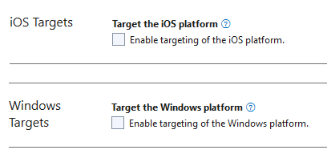

# MRZ Scanner User Guide (MAUI Edition)
This user guide will explore using the Dynamsoft MRZ Scanner (MAUI Edition) to easily integrate the ability to read MRZ data from identity documents such as passports and ID cards. The Dynamsoft MRZ Scanner comes with a ready-to-use setup that simplifies the development process, allowing you to focus on other aspects of the application.

`MRZScanner` is the ready-to-use component that allows developers to quickly set up an MRZ scanning app. With the built-in component, it streamlines the integration of MRZ scanning functionality into any application.

## Supported Machine-Readable Travel Document Types

The Machine Readable Travel Documents (MRTD) standard specified by the International Civil Aviation Organization (ICAO) defines how to encode information for optical character recognition on official travel documents.

Currently, the SDK supports three types of MRTD:

> [!Note]
> If you need support for other types of MRTDs, our SDK can be easily customized. Please contact our [support team](https://www.dynamsoft.com/contact/).

### ID (TD1 Size)

The MRZ (Machine Readable Zone) in TD1 format consists of 3 lines, each containing 30 characters.

<div>
   
</div>

### ID (TD2 Size)

The MRZ (Machine Readable Zone) in TD2 format  consists of 2 lines, with each line containing 36 characters.

<div>
   
</div>

### Passport (TD3 Size)

The MRZ (Machine Readable Zone) in TD3 format consists of 2 lines, with each line containing 44 characters.

<div>
   
</div>

## System Requirements

### .NET

- 8.0 / 9.0 / 10.0

### Android

- Supported OS: **Android 5.0** (API Level 21) or higher
- Supported ABI: **armeabi-v7a**, **arm64-v8a**, **x86** and **x86_64**
- Development Environment: Visual Studio 2022 recommended
- JDK: 1.8+

### iOS

- Supported OS: **iOS 13.0** or higher
- Supported ABI: **arm64** and **x86_64**
- Development Environment: Xcode 14.3+

## Including the Library

### Visual Studio Code for Mac

Once the MAUI app is initialized in Visual Studio Code, the easiest way to include the library is to use the .NET CLI in the terminal. All you need to do is 

1. Open the Terminal in Visual Studio Code
2. Navigate to the project root directory (please note this is the folder that is in the same directory as <Project Name>.sln)
3. Run the following command `dotnet add package Dynamsoft.MRZScannerBundle.Maui --version 3.2.3000`

If the installation is successful, you should see the following line in the *.csproj* file

```xml
<PackageReference Include="Dynamsoft.MRZScannerBundle.Maui" Version="3.2.3000" />
```

When the project is built, the package will be downloaded and installed.

> [!IMPORTANT]
> Please note that the default MAUI app configuration includes the Windows and Mac Catalyst platforms. The Dynamsoft MRZ Scanner MAUI library currently only supports iOS and Android.
>
> **Please remove the Windows and Mac Catalyst platforms from the `<TargetFrameworks>` of the *.csproj* to avoid build errors.**


> [!TIP]
> To learn fully about how to use Visual Studio Code to create a new .NET MAUI project, please visit this [guide](https://learn.microsoft.com/en-us/dotnet/maui/get-started/first-app?view=net-maui-10.0&tabs=visual-studio-code&pivots=devices-ios) by Microsoft.


### Visual Studio for Windows

You need to add the library via the project file and complete additional steps for the installation.

1. Add the library in the project file:

    ```xml
    <Project Sdk="Microsoft.NET.Sdk">
        ...
        <ItemGroup>
            ...
            <PackageReference Include="Dynamsoft.MRZScannerBundle.Maui" Version="3.2.3000" />
        </ItemGroup>
    </Project>
    ```

2. Open the **Package Manager Console** and run the following command:

    ```bash
    dotnet build
    ```

> [!IMPORTANT]
>
> Windows system paths have a limitation of 260 characters. If the console is not used to install the package, you will receive an error saying
> 
> `Could not find a part of the path 'C:\Users\admin\.nuget\packages\dynamsoft.imageprocessing.ios\2.4.200\lib\net7.0-ios16.1\Dynamsoft.ImageProcessing.iOS.resources\DynamsoftImageProcessing.xcframework\ios-arm64\dSYMs\DynamsoftImageProcessing.framework.dSYM\Contents\Resources\DWARF\DynamsoftImageProcessing'`
>
> 
> The library only support the iOS and Android platforms. Be sure that you remove the other platforms like Windows, maccatalyst, etc.

## Building the MRZ Scanner Component

Now that the package is added, it's time to start building the `MRZScanner` component.

> [!NOTE]
>
> You can get the full source code of the ScanMRZ app from this [Github repo](https://github.com/Dynamsoft/mrz-scanner-mobile-maui/tree/main/ScanMRZ){:target="_blank"}.

### Set up the Development Environment

If you are a beginner with MAUI, please follow the guide on the <a href="https://learn.microsoft.com/en-us/dotnet/maui/get-started/installation" target="_blank">.NET MAUI official website</a> to set up the development environment.

> [!TIP]
> On Mac, you need to use Visual Studio Code with the .NET MAUI extension in order to create .NET MAUI apps.

### Initialize the Project

#### Visual Studio (Windows)

1. Open the Visual Studio and select **Create a new project**.
2. Select **.NET MAUI App** and click **Next**.
3. Name the project **ScanMRZ**. Select a location for the project and click **Next**.
4. Select **.NET 10.0** and click **Create**.

#### Visual Studio Code (MacOS)

To set up a new .NET MAUI app on Visual Studio Code for Mac, please follow the instructions provided by Microsoft [here](https://learn.microsoft.com/en-us/dotnet/maui/get-started/first-app?view=net-maui-10.0&tabs=visual-studio-code&pivots=devices-ios#create-an-app-1).

> [!NOTE]
> ScanMRZ is the project name that we use throughout this guide, but of course it is not a requirement.

> [!TIP]
> Please note that this guide uses .NET 10, but you can use .NET 8 or 9 if you wish. Before doing so, please check that the version of .NET that you want to use is currently supported on this [page](https://learn.microsoft.com/en-us/dotnet/core/releases-and-support).


### Importing the Library

With the package now added to the project, you can import the library by adding the following code at the top of the **App.xaml.cs** file:

```c#
using Dynamsoft.MRZScannerBundle.Maui;
```

### Quick Start

In this section we will take you through the full *Hello World* implementation in **MainPage.xaml.cs** as well as **MainPage.xaml**.

1. First, let's edit **MainPage.xaml.cs** in order to define the operation of the MRZ Scanner

    ```c#
    using System.Collections.ObjectModel;
    using Dynamsoft.MRZScannerBundle.Maui;

    namespace ScanMRZ;

    public partial class MainPage : ContentPage
    {
        public ObservableCollection<TableItem> TableItems { get; set; } = new();

        public MainPage()
        {
            InitializeComponent();
            BindingContext = this;
        }

        private async void OnScanMRZ(object sender, EventArgs e)
        {
            // The string "DLS2eyJvcmdhbml6YXRpb25JRCI6IjIwMDAwMSJ9" here grants a time-limited free trial which requires network connection to work.
            // You can request a 30-day trial license via the Request a Trial License page https://www.dynamsoft.com/customer/license/trialLicense?product=dbr&utm_source=guide&package=maui.
            var config = new MRZScannerConfig("DLS2eyJvcmdhbml6YXRpb25JRCI6IjIwMDAwMSJ9");
            var result = await MRZScanner.Start(config);

            TableItems.Clear();

            if (result.ResultStatus == EnumResultStatus.Finished && result.Data is not null)
            {
                var data = result.Data;

                TableItems.Add(new TableItem { Key = "Name", Value = $"{data.FirstName} {data.LastName}" });
                TableItems.Add(new TableItem { Key = "Sex", Value = data.Sex.ToUpperInvariant() });
                TableItems.Add(new TableItem { Key = "Age", Value = data.Age.ToString() });
                TableItems.Add(new TableItem { Key = "Document Type", Value = data.DocumentType });
                TableItems.Add(new TableItem { Key = "Document Number", Value = data.DocumentNumber });
                TableItems.Add(new TableItem { Key = "Issuing State", Value = data.IssuingState });
                TableItems.Add(new TableItem { Key = "Nationality", Value = data.Nationality });
                TableItems.Add(new TableItem { Key = "Date Of Birth (YYYY-MM-DD)", Value = data.DateOfBirth });
                TableItems.Add(new TableItem { Key = "Date Of Expire (YYYY-MM-DD)", Value = data.DateOfExpire });
            }
            else
            {
                var msg = result.ResultStatus == EnumResultStatus.Canceled
                    ? "Scanning canceled"
                    : result.ErrorString ?? "Unknown error";

                TableItems.Add(new TableItem { Key = "Result", Value = msg });
            }
        }
    }

    public class TableItem
    {
        public string Key { get; set; }
        public string Value { get; set; }
    }
    ```

2. Edit **MainPage.xaml** to setup the UI portion of the app

   ```xml
   <?xml version="1.0" encoding="utf-8" ?>
   <ContentPage xmlns="http://schemas.microsoft.com/dotnet/2021/maui"
               xmlns:x="http://schemas.microsoft.com/winfx/2009/xaml"
               x:Class="ScanMRZ.MainPage">

       <Grid RowDefinitions="*,Auto" Padding="10">
           <CollectionView Grid.Row="0"
                           ItemsSource="{Binding TableItems}">
               <CollectionView.ItemTemplate>
                   <DataTemplate>
                       <VerticalStackLayout Padding="5">
                           <Label Text="{Binding Key}"
                               FontAttributes="Bold"
                               FontSize="16"
                               TextColor="Black" />
                           <BoxView HeightRequest="1"
                                   BackgroundColor="LightGray"
                                   Margin="0,3"/>
                           <Label Text="{Binding Value}"
                               FontSize="14"
                               TextColor="Gray" />
                           <BoxView HeightRequest="1"
                                   BackgroundColor="LightGray"
                                   Margin="0,3"/>
                       </VerticalStackLayout>
                   </DataTemplate>
               </CollectionView.ItemTemplate>
           </CollectionView>

           <Button Grid.Row="1"
                   x:Name="ScanBtn"
                   Text="Scan MRZ"
                   Clicked="OnScanMRZ"
                   HorizontalOptions="Fill"
                   VerticalOptions="End"
                   Margin="0,10,0,0" />
       </Grid>
   </ContentPage>
   ```
> [!NOTE]
>
>- The license string here grants a time-limited free trial which requires network connection to work.
>- You can request a 30-day trial license via the [Trial License portal](https://www.dynamsoft.com/customer/license/trialLicense?product=mrz&utm_source=github&package=mobile).

### MRZ Result and Data

Once the scan process completes and the MRZ Scanner successfully recognizes a MRZ, a `MRZScanResult` is produced, representing all of the decrypted data contained within the MRZ.

[`MRZScanResult`](../api-reference/mrz-scan-result.md) has the following properties:

- **resultStatus**: The status of the MRZ scan result, of type [`EnumResultStatus`](../api-reference/result-status.md).
    - *Finished*: The MRZ scan was successful.
    - *Canceled*: The MRZ scanning activity is closed before the process is finished.
    - *Exception*: Failed to start MRZ scanning or an error occurs when scanning the MRZ.
- **errorCode**: The error code indicates if something went wrong during the MRZ scanning process (0 means no error). Only defined when the `resultStatus` is `Exception`.
- **errorString**: The error message associated with the error code if an error occurs during MRZ scanning process. Only defined when the `resultStatus` is `Exception`.
- **data**: The parsed MRZ data as a `MRZData` object.
  
[`MRZData`](../api-reference/mrz-data.md) holds the actual decrypted data of the MRZ result, and it comes with the following fields:

- **documentType**: The type of MRZ document, which would either be `EnumDocumentType.Passport`, `EnumDocumentType.Id`, or `EnumDocumentType.All`. You can check out the [Supported Machine-Readable Travel Document Types](#supported-machine-readable-travel-document-types) to learn more. 
- **firstName**: The first name of the MRZ document holder.
- **lastName**: The last name of the MRZ document holder.
- **sex**: The sex of the MRZ document holder.
- **issuingState**: The issuing state of the MRZ document.
- **nationality**: The nationality of the MRZ document holder.
- **dateOfBirth**: The date of birth of the MRZ document holder.
- **dateOfExpiry**: The expiry date of the MRZ document.
- **documentNumber**: The MRZ document number.
- **age**: The age of the MRZ document holder.
- **mrzText**: The raw text of the MRZ.

### Customizing the MRZ Scanner (Optional)

Even though the default settings of the ready-to-use MRZ Scanner is sufficient to cover the majority of MRZ scanning scenarios, the [`MRZScannerConfig`](../api-reference/mrz-scanner-config.md) class allows you to change the behaviour of the MRZ Scanner to fit your specific scenario. Using this class can help you customize different UI elements and determine the settings of the scanner engine itself.

To learn of the different ways in which the MRZ scanner can be customized, please refer to the [MRZ Scanner Customization Guide](customize-mrz-scanner.md).

## Run the Project

### iOS

#### Configure Camera Permissions

Open the **Info.plist** file under the **Platforms/iOS/** folder using a IDE or text editor. Add the following lines towards the bottom (right before to request camera permission on iOS platform:

```xml
<key>NSCameraUsageDescription</key>
<string>The APP needs to access your camera.</string>
```

#### Deploying to Device

In order to deploy the app to your connected iPhone, please make sure that there is valid provisioning profile for the app ID set in the *.csproj* or else you will encounter a general build error on Visual Studio Code.

> [!TIP]
> If you are using automatic signing, one of the easiest ways to ensure that your app has a valid provisioning profile is to **create a project in Xcode with the exact same project name and app ID as the MAUI project**.
>
>
> Open the project settings, and then go to Signing & Provisioning - where you can configure the team, and make sure that it is set to *Automatically manage signing*. **You must ensure that the bundle identifier in the Xcode project is the same as the MAUI project.**

The app can then be run using the C# Dev Kit extension of Visual Studio Code per the instructions [here](https://learn.microsoft.com/en-us/dotnet/maui/get-started/first-app?view=net-maui-10.0&tabs=visual-studio-code&pivots=devices-ios).

> [!IMPORTANT]
> It is highly recommended to use the C# Dev Kit extension when developing for iOS on Visual Studio Code. However, you can also run the app via command-line.

### Android

#### Configure Camera Permissions

On Android, there is no need to configure the camera permissions as that is handled internally by the library.

#### Deploying to Device

If you are running on **Visual Studio**, simply select the target Android phone and run the project.

If you are running on **Visual Studio Code**, use the C# Dev Kit to run the Android target on the selected Android phone, similar to the iOS workflow.

> [!NOTE]
> If you are running Android only on Visual Studio Windows, please manually exclude iOS and Windows platforms. Otherwise, the Visual Studio will report type or namespace not found errors.



## Licensing

When getting started with MRZ Scanner, we recommend getting your own 30-day trial license through the following modal:



If you have any questions about the trial license or would like to inquire about acquiring a full license, do not hesitate to [contact us](https://www.dynamsoft.com/company/contact/){:target="_blank"}.
