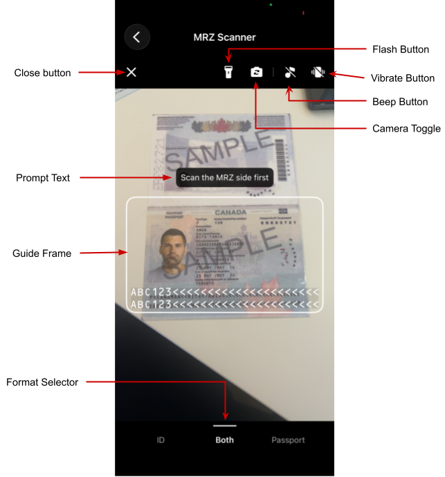

# Customizing the MRZ Scanner

When developing with `MRZScanner` (see the [User Guide](index.md)), you can add configurations via the `MRZScanConfig` class. This page will guide you on how to configure the settings.

## MRZScanConfig Overview

The [**`MRZScanConfig`**](../api-reference/mrz-scanner-config.md) class is capable of configuring almost all customization options applicable to MRZ scanning use cases with the MRZ Scanner. The MRZ Scanner passes an `MRZScanConfig` object to `MRZScanner.launch` when starting a scan. `MRZScanConfig` contains the following properties:

1. **`license`** - the license key is the only property whose ***value must be specified when instantiating the MRZ Scanner instance***. If the license is undefined, invalid, or expired, the MRZ Scanner cannot proceed with scanning, and instead displays a pop-up error message instructing the user to contact the app administrator to resolve this license issue.

2. **`documentType`** - specifies the type of document that the MRZ Scanner will recognize. This property accepts values defined in the EnumDocumentType such as `EnumDocumentType.DT_ALL`, `EnumDocumentType.DT_ID`, or `EnumDocumentType.DT_PASSPORT`. It helps the scanner to optimize its processing based on the expected document type. To learn more about the different document types that are supported, please refer to the [Supported Document Types](index.md#supported-document-types) section of the user guide.

3. **`templateFile`** - a template file is a JSON file or JSON string that contains a series of algorithm parameter settings (called Capture Vision templates) that is usually used for very specific and customized scanning and parsing scenarios. The `templateFile` points to the location of the JSON file. The MRZ Scanner comes with a default template file, but you may choose to use a custom template to target specialized use cases. We recommend contacting the [Dynamsoft Technical Support Team](https://www.dynamsoft.com/company/contact/) for assistance with template customization.

4. **`templateNodeRequire`** - supplies a template configuration as a `require`-resolved object, which is the standard way to load a bundled JSON asset in a React Native app (Metro resolves `require('./my-template.json')` at build time). Use this when you want Metro to bundle a template JSON alongside your app code. If both `templateFile` and `templateNodeRequire` are provided, `templateFile` takes precedence.

5. **`isBeepEnabled`** (default value `false`) - a boolean that determines whether a beep sound is triggered upon a successful MRZ scan. When enabled (true), the scanner will play a sound to provide audible feedback.

6. **`isCameraToggleButtonVisible`** (default value `false`) - a boolean that specifies whether the camera toggle button is displayed. This button lets users switch between available cameras (e.g., front and rear).

7. **`isCloseButtonVisible`** (default value `true`) - a boolean to control the visibility of the close button on the scanner's UI. If true, a close button will be displayed allowing users to exit the MRZ scanning interface.

8. **`isGuideFrameVisible`** (default value `true`) - serves as a toggle to show or hide the guide frame in the UI during scanning. The guide frame assists users in properly aligning the document for optimal MRZ detection. When set to true, a visual overlay is displayed on the scanning interface.

9. **`isTorchButtonVisible`** (default value `true`) - determines whether the torch (flashlight) toggle button is visible on the scanning interface. Set to true to allow users to switch the device's flashlight on or off during MRZ scanning.

10. **`isVibrateEnabled`** (default value `false`) - controls the scanner's ability to make the scanning device vibrate upon a successful MRZ scan. When enabled (true), the scanner will vibrate to provide haptic feedback if the device supports it.

11. **`isBeepButtonVisible`** (default value `true`) - controls whether the beep toggle button is visible in the scanning UI. When visible, users can tap this button to enable or disable the beep sound directly from the scanner interface.

12. **`isVibrateButtonVisible`** (default value `true`) - controls whether the vibrate toggle button is visible in the scanning UI. When visible, users can tap this button to enable or disable vibration feedback directly from the scanner interface.

13. **`isFormatSelectorVisible`** (default value `true`) - controls whether the document format selector is displayed at the bottom of the scanning UI. The format selector allows users to switch between scanning ID cards, passports, or both.

14. **`returnDocumentImage`** (default value `true`) - controls whether a cropped document image is included in the scan result. When enabled, `MRZScanResult.mrzSideDocumentImage` and `MRZScanResult.oppositeSideDocumentImage` will contain the document images.

15. **`returnOriginalImage`** (default value `false`) - controls whether the original full-frame camera image is included in the scan result. When enabled, `MRZScanResult.mrzSideOriginalImage` and `MRZScanResult.oppositeSideOriginalImage` will contain the raw camera frames.

16. **`returnPortraitImage`** (default value `true`) - controls whether the detected portrait image is included in the scan result. When enabled, `MRZScanResult.portraitImage` will contain the portrait extracted from the document.

Next, we go over the different ways that these properties can be used to customize the scanner with a few examples.

## Setting the MRZ Document Type

Specifies the type of document to scan, such as ID cards or passports. It also improves the processing speed and accuracy.

```ts
const config = {
  license: 'DLS2eyJvcmdhbml6YXRpb25JRCI6IjIwMDAwMSJ9',
  documentType: EnumDocumentType.DT_PASSPORT, // only read passports
} as MRZScanConfig;
const mrzResult = await MRZScanner.launch(config);
```

**Related APIs**

- [`documentType`](../api-reference/mrz-scanner-config.md#documenttype)
- [`templateFile`](../api-reference/mrz-scanner-config.md#templatefile)
- [`templateNodeRequire`](../api-reference/mrz-scanner-config.md#templatenoderequire)

## Configure the UI Elements

<div align="center">
    <p></p>
    <p>MRZ Scanner UI</p>
</div>

The MRZ Scanner UI includes the following configurable elements:

- **Close button**: Dismisses the scanner and returns the user to the previous screen.
- **Torch button**: Turns the device flashlight on or off to improve scanning in low-light conditions.
- **Camera toggle button**: Switches between the front and rear cameras for flexible document placement.
- **Beep button**: Lets users enable or disable the audible beep that plays on a successful scan.
- **Vibrate button**: Lets users enable or disable haptic vibration feedback on a successful scan.
- **Prompt text**: A status label that updates dynamically to guide users through each step of the scanning process.
- **Guide frame**: A viewfinder overlay that guides users in positioning the document within the camera frame.
- **Format selector**: A bottom control bar for selecting the target document type — ID card, passport, or both.

All UI elements are visible by default. Use the following configuration to hide any elements that are not needed for your use case:

```ts
const config = {
  license: 'DLS2eyJvcmdhbml6YXRpb25JRCI6IjIwMDAwMSJ9',
  isCloseButtonVisible: false,
  isTorchButtonVisible: false,
  isCameraToggleButtonVisible: false,
  isBeepButtonVisible: false,
  isVibrateButtonVisible: false,
  isFormatSelectorVisible: false,
  isGuideFrameVisible: false,
} as MRZScanConfig;
const mrzResult = await MRZScanner.launch(config);
```

**Related APIs**

- [`isCloseButtonVisible`](../api-reference/mrz-scanner-config.md#isclosebuttonvisible)
- [`isTorchButtonVisible`](../api-reference/mrz-scanner-config.md#istorchbuttonvisible)
- [`isCameraToggleButtonVisible`](../api-reference/mrz-scanner-config.md#iscameratogglebuttonvisible)
- [`isBeepButtonVisible`](../api-reference/mrz-scanner-config.md#isbeepbuttonvisible)
- [`isVibrateButtonVisible`](../api-reference/mrz-scanner-config.md#isvibratebuttonvisible)
- [`isFormatSelectorVisible`](../api-reference/mrz-scanner-config.md#isformatselectorvisible)
- [`isGuideFrameVisible`](../api-reference/mrz-scanner-config.md#isguideframevisible)

## Enabling Haptic and Audio Feedback

The MRZ Scanner can play a beep sound or vibrate the device upon a successful scan. Both are disabled by default.

> [!NOTE]
> The `isBeepEnabled` and `isVibrateEnabled` settings control the feedback *behavior*. To hide the buttons that allow users to toggle these behaviors from the scanning UI, use `isBeepButtonVisible` and `isVibrateButtonVisible`.

```ts
const config = {
  license: 'DLS2eyJvcmdhbml6YXRpb25JRCI6IjIwMDAwMSJ9',
  isBeepEnabled: true,
  isVibrateEnabled: true,
} as MRZScanConfig;
const mrzResult = await MRZScanner.launch(config);
```

**Related APIs**

- [`isBeepEnabled`](../api-reference/mrz-scanner-config.md#isbeepenabled)
- [`isVibrateEnabled`](../api-reference/mrz-scanner-config.md#isvibrateenabled)
- [`isBeepButtonVisible`](../api-reference/mrz-scanner-config.md#isbeepbuttonvisible)
- [`isVibrateButtonVisible`](../api-reference/mrz-scanner-config.md#isvibratebuttonvisible)

## Configure Scan Result Images

By default, the scan result includes a cropped document image and a portrait image. You can control which images are returned to reduce memory usage or processing overhead for your use case.

```ts
const config = {
  license: 'DLS2eyJvcmdhbml6YXRpb25JRCI6IjIwMDAwMSJ9',
  returnDocumentImage: true,   // Cropped document image (default: true).
  returnPortraitImage: true,   // Portrait image (default: true).
  returnOriginalImage: false,  // Original full-frame image (default: false).
} as MRZScanConfig;
const mrzResult = await MRZScanner.launch(config);
```

Once configured, access the images from the `MRZScanResult`. Each image is an `ImageSourcePropType` and can be passed directly to a React Native `<Image>` element via its `source` prop:

- `mrzSideDocumentImage` - the cropped document image of the MRZ side.
- `oppositeSideDocumentImage` - the cropped document image of the opposite side.
- `mrzSideOriginalImage` - the original full-frame image of the MRZ side.
- `oppositeSideOriginalImage` - the original full-frame image of the opposite side.
- `portraitImage` - the detected portrait image.

**Related APIs**

- [`returnDocumentImage`](../api-reference/mrz-scanner-config.md#returndocumentimage)
- [`returnPortraitImage`](../api-reference/mrz-scanner-config.md#returnportraitimage)
- [`returnOriginalImage`](../api-reference/mrz-scanner-config.md#returnoriginalimage)
- [`mrzSideDocumentImage`](../api-reference/mrz-scan-result.md#mrzsidedocumentimage)
- [`oppositeSideDocumentImage`](../api-reference/mrz-scan-result.md#oppositesidedocumentimage)
- [`mrzSideOriginalImage`](../api-reference/mrz-scan-result.md#mrzsideoriginalimage)
- [`oppositeSideOriginalImage`](../api-reference/mrz-scan-result.md#oppositesideoriginalimage)
- [`portraitImage`](../api-reference/mrz-scan-result.md#portraitimage)

## Further Customization

If you have other customization requirements on the `MRZScanner` component, you can modify it with the [open source code on GitHub](https://github.com/Dynamsoft/capture-vision-react-native-samples).
