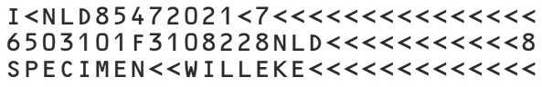

# Supported Document Types

The Dynamsoft MRZ Scanner supports three ICAO Machine Readable Travel Document (MRTD) formats. The Machine Readable Zone (MRZ) is the striped region at the bottom of a travel document that encodes identity information for optical character recognition.

> [!NOTE]
> If you need support for other MRTD types, the SDK can be customized. Contact the [Dynamsoft Support Team](https://www.dynamsoft.com/contact/).

## TD1 — ID Card (3-Line MRZ)

The MRZ in TD1 format consists of 3 lines with 30 characters each.

   

## TD2 — ID Card (2-Line MRZ)

The MRZ in TD2 format consists of 2 lines with 36 characters each.

   

## TD3 — Passport (2-Line MRZ)

The MRZ in TD3 format consists of 2 lines with 44 characters each.

   

